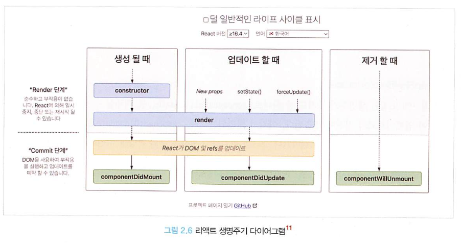
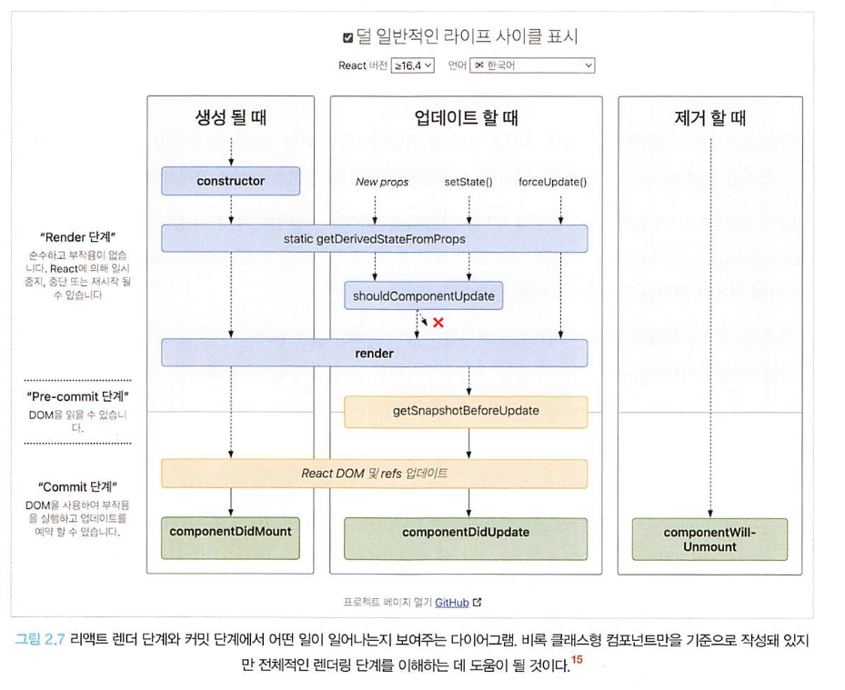

# 02. 리액트 핵심 요소 깊게 살펴보기

> 이번 장에서는 리액트에서 자주 언급되는 핵심 개념에 대해 정리해보겠습니다. 자주 사용되는 개념만큼 익숙하겠지만, 무의식적으로 사용해온 기능들이 어떤 스펙으로 어떻게 동작하는지를 알아보여 이러한 기등이 자바스크립트를 기반으로 또 어떻게 동작하는지를 알아보겠습니다.

## 02.1. JSX란?

- JSX는 XML과 유사한 내장형 구문이며 리액트에 종속적이지 않은 독자적인 문법입니다.
- JSX는 자바스크립트 표준코드가 아니기 때문에 자바스크립트 런타임에서 바로 실행이 불가능합니다.
- 반드시 트랜스파일러를 거쳐 자바스크립트 런타임이 이해할 수 있는 자바스크립트 코드로 변환되어야 합니다.
- JSX는 HTML 혹은 XML을 자바스크립트 내무에 표현하는 것이 유일한 목적이 아닙니다.
  - **JSX의 설계 목적은 다양한 트랜스파일러에서 다양한 속성을 가진 트리 구조를 토큰화해 ECMAScript로 변환하는 데 초점을 두고 있습니다.**
  - 조금 더 쉽게 이야기하면 JSX 내부에 트리 구조로 표현하고 싶은 다양한 내용들을 작성해두고, JSX를 트랜스파일 과정을 거쳐 자바스크립트가 이해할 수 있는 코드로 변경하는 것을 목적으로 두고 있습니다.

### 02.1.1. JSX의 정의

> JSX는 기본적으로 JSXElement, JSXAttrobutes, JSXString, JSXChildren 의 4가지 컴포넌트를 기반으로 구성되어있습니다.

#### JSXElement

- JSX를 구성하는 가장 기본 요소로, HTML의 element와 유사한 역할을 합니다. JSXElement가 되기 위해서는 다음과 같은 형태 중 하나이어야 합니다.

  1.JSXOpeningElement

  - 일반적으로 볼 수 있는 요소입니다. JSXOpeningElement로 시작했다면 후술할 JSXClosingElement가 동일한 요소로 같은 단계에서 선언돼 있어야 올바른 JSX 문법으로 간주됩니다.

    - 예: <JSXElement JSXAttributes(optional)>

    > 말을 어렵게써서 그렇지 꺽쇠가 열리고(opening) 꺽쇠가 닫히는(closing) 저희가 익히 알고있는 태그 사용 예시네요

  2. JSXClosingElement

  - 예: <JSXElement />

  3. JSXSelfClosingElement

  - 요소가 시작되고, 스스로 종료되는 형태를 의미합니다. `<script />`와 동일한 모습을 띄고 있습니다. (children을 허용하지 않음)

    - 예: <JSXElement JSXAttribute(optional) />

  4. JSXFragment

  - 아무런 요소가 없는 형태로, JSXSelfClosingElement 형태를 띌 수는 없습니다.

    - 예: <>JSXChildren(optional)</>

> ##### 요소명은 대문자로 시작해야만 되는 거 아니었나요?
>
> 리액트에서 HTML 구문 이외 사용자 컴포넌트 사용시 반드시 대문자로 컴포넌트 명을 지어야 사용 가능합니다.
> 이는 JSX 표준에는 없는 내용인데, 그 이유는 리액트에서 HTML 태그명과 사용자가 만든 컴포넌트 태그명을 구분 짓기 위해서 입니다.

> JavaScript에서는 이벤트 핸들러를 onChange로 표현하지만 HTML에서는 onchange로 표현하는 것과 유사한거같습니다

#### JSXElementName

- JSXElementName은 JSXElement의 요소 이름으로 사용할 수 있는 것을 의미합니다.

  1. JSXIdentifier

  - JSX 내부에서 사용할 수있는 식별자를 의미합니다. 자바스크립트 식별자 규칙과 동일합니다.

  2. JSXNamespacedName

  - `JSXIdentifier : JSXIdentifier`의 조합입니다.
  - `:`를 사용하여 서로 다른 식별자를 이어주는 것도 하나의 식별자로 취급됩니다.

  3. JSXMemberExpression

  - `JSXIdentifier.JSXIdentifier`의 조합입니다.
  - JSXNamespacedName과는 다르게 여러 개 이러서 하는 것도 가능합니다.

#### JSXAttributes

- JSXElement에 부여할 수 있는 속성을 의미합니다.
- 단순히 속성을 의미하기 때문에 옵셔널한 값이며, 존재하지 않아도 에러가 나지 않습니다.

#### JSXChildren

- JSXElement의 자식 값을 나타냅니다.
- JSX는 앞서 언급했듯 속성을 가진 트리 구조를 표현하기 위해 만들어졌기 때문에 JSX로 부모와 자식 관계를 나타낼 수 있습니다.

#### JSXString

- HTML에서 사용 가능한 문자열은 모두 JSXString에서도 사용 가능합니다.
- 이는 개발자가 HTML의 내용을 손싑게 JSX로 가져올 수 있도록 의도적으로 설계된 부분입니다.
- 하지만 한가지 자바스크립트와는 중요한 차이점이 존재합니다.
  - `\`로 시작하는 이스케이프 문자 형태소 입니다.
  - `\`는 자바스크립트에서 특수문자를 처리할 때 사용되무로 몇 가지 제약 사항이 있지만 HTML에서는 아무런 제약 없이 사용 가능합니다.

### 02.1.2. JSX 예제

> 간단 JSX 문법 예시 생략

- 이 외에도 리액트 내에서는 유효하지 않거나 사용되는 경우가 거의 없는 문법도 JSX 문법 자체로는 유효합니다.

```tsx
function ComponentA() {
  return <A.B></A.B>;
}

function ComponentB() {
  return <A.B.C></A.B.C>;
}

function ComponentC() {
  return <A:B.C></A:B.C>;
}

// 그 외 등등
```

### 02.1.3. JSX는 어떻게 자바스크립트에서 변환될까?

- 자바스크립트에서 JSX가 변환되는 방식을 알기 위해서는 리액트에서 JSX를 변환해주는 `@babel/plugin-transfrom-react-jsx`플러그인을 알아야 합니다.
  - 리액트에서는 해당 플러그인을 사용하여 JSX구문을 자바스크립트가 이해할 수 있는 형태로 변환합니다.

```tsx
const ComponentA = <A required={true}>Hello World</A>;

const ComponentB = <>Hello World</>;

const ComponentC = (
  <div>
    <span>hello world</span>
  </div>
);
```

- 위 예시를 변환한 결과는 아래와 같습니다.

  ```tsx
  "use strict";

  var ComponentA = React.createElement(
    A,
    {
      required: true,
    },
    "Hello World"
  );

  var ComponentB = React.createElement(React.Fragment, null, "Hello World");

  var ComponentC = React.createElement(
    "div",
    null,
    React.createElement("span", null, "hello world")
  );
  ```

- 리액트 17, babel 7.9.0 이후 버전에서 추가된 자동 런타임으로 트랜스파일한 결과는 아래와 같습니다.

  ```tsx
  "use strict";

  var _jsxRuntime = require("custom-jsx-library/jsx-runtime");

  var ComponentA = (0, _jsxRuntime.jsx)(A, {
    required: true,
    children: "Hello World",
  });

  var ComponentB = (0, _jsxRuntime.jsx)(_jsxRuntime.Fragment, {
    children: "Hello World",
  });

  var ComponentC = (0, _jsxRuntime.jsx)("div", {
    children: (0, _jsxRuntime.jsx)("span", {
      children: "hello world",
    }),
  });
  ```

- 두 결과물에서는 약간의 차이가 있지만 아래와 같은 공통점이 존재합니다.
  1. JSXElement를 첫 번째 인수로 선언해 요소를 정의합니다.
  2. 옵셔널인 JSXChildren, JSXAttributes, JSXStrings
- 이러한 공통점을 활용한다면 경우에 따라 다른 JSXElement를 렌더링해야 할 때 굳이 요소 전체를 감싸지 않더라도 처리할 수 있습니다.

  - 이런 특성은 JSXElement만 다르고, JSXAttributes, JSXChildren이 완전히 동일한 상황에서 중복 코드를 최소화 할 수 있어 유용합니다.

  ```tsx
  // ❌ props 여부에 따라 children 요소만 달라지는 경우
  // 곧이 범키울게 전체 내용을 삭향 연산자로 처리할 필요가 있다.
  // 이 경우 불필요한 코드 중복이 일어난다.
  function TextOrHeading({
    isHeading,
    children,
  }: PropsWithChildren<{ isHeading: boolean }>) {
    return isHeading ? (
      <h1 className="text">{children}</h1>
    ) : (
      <span className="text">{children}</span>
    );
  }

  // ⭕ JSX가 변환되는 특성을 활용하면 다음과 같이 간결하게 처리할 수 있다.
  import { createElement } from "react";

  function TextOrHeading({
    isHeading,
    children,
  }: PropsWithChildren<{ isHeading: boolean }>) {
    return createElement(
      isHeading ? "h1" : "span",
      { className: "text" },
      children
    );
  }
  ```

  - JSX 반환값이 결국 React.createElement로 귀결된다는 사실을 파악한다면 위 내용으로 리펙터링 진행이 가능합니다.

### 추가 정리 JSX With TypeScript

- [관련 정리 내용 - JSX에서 TSX로](https://github.com/codingaring/woowahan-typeScript/tree/main/%EA%B9%80%EB%B3%B4%EA%B2%BD/08.%20JSX%EC%97%90%EC%84%9C%20TSX%EB%A1%9C)

#### JSX.Element

```ts
declare global {
  namespace JSX {
    interface Element extends React.ReactElement<any, any> {}
  }
}
```

- JSX.Element타입은 앞의 코드를 보면 알 수 있다시피 리액트의 ReactElement를 확장하고 있는 타입이며, 글로벌 네임스페이스에 정의되어 있어 외부 라이브러리에서 컴포넌트 타입을 재정의 할 수 있는 유연성을 제공합니다.
- 실제 흐름: JSX → ReactElement ← JSX.Element

  - JSX 문법 (컴파일 타임) => createElement 호출 (런타임) => 메서드 실행 => ReactElement 객체 생성 (런타임)

    ```tsx
    // 1. JSX 코드 (우리가 작성하는 코드)
    const element = <h1 className="greeting">Hello, world!</h1>;

    // 2. 트랜스파일러가 변환 (Babel, TypeScript 등)
    const element = React.createElement(
      "h1",
      { className: "greeting" },
      "Hello, world!"
    );

    // 3. createElement 메서드의 실제 반환값 (런타임)
    const element = {
      type: "h1",
      props: {
        className: "greeting",
        children: "Hello, world!",
      },
      key: null,
      // 기타 React 내부 속성들...
    };
    ```

## 02.2. 가상 DOM과 리액트 파이버

### 02.2.1. DOM과 브라우저 렌더링 과정

- 가상 DOM에 대해 다루기 앞서 DOM이란 무엇인지 부터 알아보겠습니다.
- DOM(Document Object Model)은 웹페이지에 대한 인터페이스로 브라우저가 웹페이지의 콘텐츠와 구조를 어떻게 보여줄지에 대한 정보를 담고 있습니다.
- 본격적인 DOM의 정의를 다루기에 앞서 먼저 브라우저가 웹사이트 접근 요청을 받고 화면을 그리는 과정에서 정확히 어떠한 일이 일어나는지 알아보겠습니다.
  ```md
  1. 브라우저가 사용자가 요천한 주소를 방문해 HTML파일을 다운로드한다.
  2. 브라우저 렌더링 엔진은 HTML을 파싱해 DOM 노드로 구성된 트리(DOM)를 만든다.
  3. 2번 과정에서 CSS 파일을 만나면 해당 CSS 파일도 다운로드 한다.
  4. 브라우저의 렌더링 엔진은 이 CSS도 파싱하여 CSS 노드로 구셩된 트리(CSSOM)를 만든다.
  5. 브라우저는 2번에서 만든 DOM 노드를 순회하는데, 여기서 모든 노드를 방문하는 것이 아닌 사용자에게 보여지는 노드만 방문한다.
  6. 5번에서 제외된, 눈에 보이는 노드를 대상으로 해당 노드에 대한 CSSOM 정보를 찾고 여기서 발견한 CSS 스타일 정보를 이 노드에 적용한다. 이 DOM 노드에 CSS를 적용하는 과정은 크게 두 가지로 나눌 수 있다.
     - 레이아웃, 리플로우: 각 노드가 브라우저 화면의 어느 좌표에 정확히 나타나야 하는지 계산하는 과정. 이 레이아웃 과정을 거치면 반드시 페인팅 과정도 거치게 된다.
     - 페인팅: 레이아웃 단계를 거친 노드에 색과 같은 실제 유효한 모습을 그리는 과정
  ```

### 02.2.2. 가상 DOM의 탄생 배경

- 위에서는 생략했지만 브라우저가 웹페이지를 렌더링 하는 과정은 매우 복잡하고 많은 비용이 필요합니다.
- 각설하고 이러한 문제접을 해결하기 위해 탄생한 것이 바로 가상 DOM 입니다. 두둥탁
  - 가상 DOM은 말 그대로 실제 브라우저의 DOM이 아닌 리액트가 관리하는 가상의 DOM을 의미합니다.
  - 가상 DOM은 웹페이지가 표시해야 할 DOM을 일단 메모리에 저장하고 리액트가 실제 변경에 대한 준비가 완료되었을 때 실제 브라우저의 DOM에 반영합니다.
    - 정확히 이야기하면 package.json에 있는 react의존성이 아닌 react-dom을 의미합니다.
  - 이렇게 DOM 계산을 브라우저가 아닌 메모리에서 계산하는 과정을 한 번 거치게 된다면 실제로는 여러 번 발생했을 렌더링 과정을 최소화할 수 있고 브라우저와 개발자의 부담을 덜 수 있습니다.
- **가상 DOM에 대한 한가지 일반적인 오해는 리액트의 이러한 방식이 일반적인 DOM을 관리하는 브라우저보다 빠르다는 사실입니다.**
  - 무조건 빠른 것이 아니라 리액트의 가상 DOM 방식은 대부분의 상황에서 왠만한 애플리케이션을 만들 수 있을 정도로 충분히 빠르다는 것 입니다.

### 02.2.3. 가상 DOM을 위한 아키텍처, 리액트 파이버

- 리액트에서는 가상 DOM을 만드는 과정을 어떻게 처리하고 있을까용가리?
  - 여러번의 렌더링 과정을 압축하여 최소한의 렌더링 단위를 만들어주는 가상 DOM과 렌더링 과정의 최적화를 가능하게 해주는 것이 **리액트 파이버(React Fiber)** 입니다.

#### **리액트 파이버란?** - 암기 필요 ⭐️⭐️⭐️⭐️

- 리액트 파이버는 리액트에서 관리하는 평범한 자바스크립트 객체입니다.
- 파이버는 파이버 재조정자(fiber reconciler)가 관리하는데, 이는 앞서 이야기한 가상 DOM과 실제 DOM을 비교하여 변경 사항을 수집하며, 만약 이 둘 사이에 차이가 있으면 변경에 관련된 정보를 가지고 있는 파이버를 기준으로 화면에 렌더링을 요청하는 역할을 합니다.
  - 재조정(reconciliation)이라는 용어가 낯설겠지만 리액트에서 어떤 부분을 새롭게 렌더링해야 하는지 가상 DOM과 실제 DOM을 비교하는 작업(알고리즘)이라고 이해하면 됩니다.
- 리액트 파이버의 목표는 리액트 웹 애플리케이션에서 발생하는 애니메이션, 레이아웃, 그리고 사용자 인터렉션에 올바른 결과물을 만드는 반응성 문제를 해결하는 것 입니다.
- 이를 위해 파이버는 다음과 같은 작업을 할 수 있습니다.
  1. 작업을 작은 단위로 분할하고 쪼갠 다음, 우선순위를 매긴다.
  2. 이러한 작업을 일시중지하고 나중에 다시 시작할 수 있다.
  3. 이전에 했던 작업을 다시 재사용하거나 필요하지 않은 경우에는 폐기할 수 있다.
- 그리고 한가지 중요한 것은 이러한 모든 과정이 비동기로 일어난다는 것 입니다.
  - 과거 리액트에서는 리액트의 조정 알고리즘은 스택 알고리즘으로 이루어져 있었습니다.
  - 스택에서 유츄할 수 있듯이 동기적으로 작업이 이루어졌습니다.
  - 자바스크립트 싱글 스레드 특징으로 인해 동기 작업은 중단될 수 없으며, 다른 작업이 수행되고 싶어도 중단할 수 없었으며, 결국 리액트의 비효율성으로 이어졌습니다.
  - 이러한 기존 렌더링 스택의 비효율성을 타파하기 위해 리액트 팀에서는 스택 조정자 대신 파이버라는 개념을 탄생시켰습니다.
- 파이버는 어떻게 구현되어 있을까요?
  - 파이버는 일단 하나의 작업 단위로 구성되어 있습니다.
  - 리액트는 이러한 작업 단위를 하나씩 처리하고 `finishedWork()`라는 작업으로 마무리합니다.
  - 그리고 이 작업을 커밋하여 실제 브라우저 DOM에 가시적인 변경 사항을 만들어냅니다.
  - 이런 단계들은 두 단계로 분류할 수 있습니다.
    1. 렌더 단계에서 리액트는 사용자에게 노출되지 않는 모든 비동기 작업을 수행합니다. 그리고 이 단계에서 앞서 언급한 파이버의 작업, 우선순위를 지정하거나 중지시키거나 버리는 등의 작업이 일어납니다.
    2. 커밋 단계에서는 앞서 언급한 것처럼 DOM에 실제 변경 사항을 반영하기 위한 작업, `commitWork()`가 실행되는데, 이 과정은 앞서와 다르게 동기식으로 일어나고 중단될 수도 없습니다.
- 파이버의 실제 리액트 코드를 확인해보겠습니다.

  ```ts
  function FiberNode(tag, pendingProps, key, mode) {
    // Instance
    this.tag = tag;
    this.key = key;
    this.elementType = null;
    this.type = null;
    this.stateNode = null;

    // Fiber
    this.return = null;
    this.child = null;
    this.sibling = null;
    this.index = 0;

    this.ref = null;
    this.refCleanup = null;

    this.pendingProps = pendingProps;
    this.memoizedProps = null;
    this.updateQueue = null;
    this.memoizedState = null;
    this.dependencies = null;

    this.mode = mode;

    // Effects
    this.flags = NoFlags;
    this.subtreeFlags = NoFlags;
    this.deletions = null;

    this.lanes = NoLanes;
    this.childLanes = NoLanes;

    this.alternate = null;

    // 이하 프로퍼티들, __DEV__ 코드는 생략
  }
  ```

  - 책에서는 파이버를 단순 자바스크립트 객체로 설명하는데 아무튼 객체로 구성되어있긴 합니다.
  - 파이버는 리액트 요소와 유사하다고 느낄 수 있지만 한 가지 중요한 차이점은 리액트 요소는 렌더링이 발생할 때마다 새롭게 생성되지만 파이버는 가급적이면 재사용된다는 사실입니다.
  - 파이버는 컴포넌트가 최초로 마운트 되는 시점에 생성되어 이후에는 가급적이면 재사용됩니다.

- 생성되는 파이버는 state가 변경되거나 생명주기 메서드가 실행되거나 DOM의 변경이 필요한 시점 등에 실행됩니다.
- **중요한 것은 리액트가 파이버를 처리할 때마다 이러한 작업을 직접 바로 처리하기도 하고 스케줄링하기도 한다는 것입니다.**
  - 즉, 이러한 작업들은 작은 단위로 나눠서 처리할 수도, 애니메이션과 같이 우선순위가 높은 작업은 가능한 한 빠르게 처리하거나, 낮은 작업을 연기시키는 등 좀 더 유연하게 처리됩니다..
- 파이버의 객체 값에서 알 수 있듯이 리액트의 핵심 원칙은 UI를 문자열, 숫자, 배열과 같은 값으로 관리한다는 것입니다.
  - 변수에 이러한 UI관련 값을 보관하고, 리액트의 자바스크립트 코드 흐름에 따라 이를 관리하고 표현하는 것이 바로 리액트 입니다.
    > 최근 FEConf에서 리액트 컴파일러 관련 강연들 들었는데, 실제로 컴파일러의 결과물을 살펴보면 책에서 이야기하는 내용이 무엇인지 이해가 되는 요소들이 있습니다.

#### 리액트 파이버 트리

- 파이버 트리는 리액트 내부에서 두 개가 존재합니다. 하나는 현재 모습을 담은 파이버 트리이고, 다른 하나는 작업 중인 상태를 나타내는 `workInProgress`트리입니다.
  - 리액트 파이버의 작업이 끝나면 리액트는 단순히 포인터만 변경해 `workInProgress` 트리를 현재 트리로 바꿔버립니다.
  - 이러한 기술을 더블 버퍼링 이라고 표현합니다.
    > ##### 아하모먼트 😇
    >
    > 더블 버퍼링은 컴퓨터 그래픽 분야에서 사용하는 용어입니다.
    > 그래픽을 통해 화면에 표시되는 것을 그리기 위해서는 내부적으로 처리를 거쳐야 하는데, 이러한 처리를 거치게 되면 사용자에게 미처 다 그리지 못한 모습을 보는 경우가 발생하게 됩니다.
    > 이러한 상황을 방지하기 위해 보이지 않는 곳에서 그 다음으로 그려야 할 그림을 미리 그린 다음, 완성 후 새로운 그림으로 바꾸는 기법을 의미합니다.
  - 리액트에서도 미처 다 그리지 못한 모습을 노출시키지 않기 위해(불완전한 트리를 노출하지 않도록) 더블 버퍼링 기법을 사용합니다.
    - 이러한 더블 버퍼링을 위해 트리가 두 개 존재하며, 이 더블 버퍼링은 커밋 단계에서 수행됩니다.
      - 먼저 현재 UI 렌더링을 위해 존재하는 트리인 current를 기준으로 모든 작업이 시작됩니다.
      - 여기에서 만약 업데이트가 발생하면 파이버는 리액트에서 새로 받은 데이터로 새로운 `workInProgress`트리를 빌드하기 시작합니다.
      - `workInProgress`트리를 빌드하는 작업이 끝나면 다음 렌더링에 이 트리를 사용합니다.
      - 그리고 이 `workInProgress`트리가 UI에 최종적으로 렌더링되어 반영이 완료되면 current가 이 `workInProgress`로 변경됩니다.

#### 파이버의 작업 순서

- 파이버 트리와 파이버가 어떤 식으로 작동하는지 흐름을 살펴보겠습니다.
  - 일반적인 파이버 노드의 생성 흐름은 아래와 같습니다.
    1. 리액트는 `beginWork()` 함수를 실행하여 파이버 작업을 수행하는데, 더 이상 자식이 없는 파이버를 만날 때까지 트리 형식으로 시작됩니다.
    2. 1번에서 작업이 끝난다면 그 다음 `completeWork()` 함수를 실행하여 파이버 작업을 완료합니다.
    3. 형제가 있다면 형제로 넘어갑니다.
    4. 2번 3번이 모두 끝났다면 return 으로 돌아가 자신의 작업이 완료되었음을 알립니다.
  ```tsx
  <A1>
    <B1>안녕하세요</B1>
    <B2>
      <C1>
        <D1 />
        <D2 />
      </C1>
    </B2>
    <B3 />
  </A1>
  ```
  - 위 작업은 해당 JSX 코드에서 다음과 같이 수행됩니다.
    1. A1의 `beginWork()`가 수행된다.
    2. A1은 자식이 있으므로 B1로 이동해 `beginWork()`를 수행한다.
    3. B1은 자식이 없으므로 `completeWork()`가 수행된다. 자식은 없으므로 형제인 B2로 넘어간다.
    4. B2의 `beginWork()`가 수행된다. 자식이 있으므로 C1로 이동한다.
    5. C1의 `beginWork()`가 수행된다. 자식이 있으므로 D1로 이동한다.
    6. D1의 `beginWork()`가 수행된다.
    7. D1은 자식이 없으므로 `completeWork()`가 수행된다. 자식은 없으므로 형제인 D2로 넘어간다.
    8. D2는 자식이 없으므로 `completeWork()`가 수행된다.
    9. D2는 자신도 더 이상의 형제도 없으므로 위 이동해 D1, C1, B2 순으로 `completeWork()`를 요청한다.
    10. B2는 형제인 B3으로 이동해 `beginWork()`를 수행한다.
    11. B3의 `completeWork()`가 수행되면 반환해 상위로 타고 올라간다.
    12. A1의 `completeWork()`가 수행된다.
    13. 루트 노드가 완성되는 순간, 최종적으로 `commitWork()`가 수행되고 이 중에 변경 사항이 DOM에 반영된다.
  - 여기에서 setState등이로 업데이트가 발생하면 어떻게 될까요?
    - 이미 리액트는 앞서 만든 current 트리가 존재하고, setState로 인한 업데이트 요청을 받아 `workInProgress`트리를 다시 빌드하기 시작합니다.
    - 최초 렌더링 시에는 모든 파이버를 새롭게 만들어야 하지만, 이제는 파이버가 이미 존재하므로 가급적 새로 생성하지 않고 기존 파이버에서 업데이트된 props를 받아 파이버 내부에서 처리합니다.
- 현재의 리액트에서는 우선순위가 높은 다른 업데이트가 오면 현재 업데이트 작업을 일시 중단하거나 새로 만들거나, 폐기할 수 도 있습니다. 또한 작업 단위를 나누어 우선순위를 할당하는 것 또한 가능합니다.
- 리액트는 이러한 작업을 파이버 단위로 나누어 수행합니다. 이로 인해 우선순위가 낮은 작업으로 분리하여 최적의 순위로 작업을 완료할 수 있게끔 만듭니다.

### 02.2.4. 파이버와 가상 DOM

- 앞서 언급했듯이 리액트 컴포넌트에 대한 정보를 1:1로 가지고 있는 것이 파이버 입니다.
- 파이버는 리액트 아키텍처 내부에서 비동기로 이루어집니다.
- 이러한 비동기 작업과 달리, 실제 브라우저 구조인 DOM에 반영하는 것은 동기적으로 일어나야 하고, 또 처리하는 작업이 많아 화면에 불완전하게 표시될 수 있는 가능성이 높으므로 이러한 작업을 가상에서, 즉 메모리상에서 먼저 수행하여 최종적인 결과물만 실제 브라우저 DOM에 적용하는 것 입니다.
  > 요즘 기술질문에 대한 공부를 다시 진행중인데, 가상돔에서 파이버로 이어지는 내용을 알고있어도 좋을거같다는 생각이 듭니다.

## 02.3. 클래스형 컴포넌트와 함수형 컴포넌트

### 02.3.1. 클래스형 컴포넌트

#### 클래스형 컴포넌트의 생명주기 메서드

- 클래스형 컴포넌트를 사용하면서 가장 자주 언급되는 것이 바로 생명주기(life cycle) 입니다.
- 클래스형 컴포넌트에서는 많은 코드가 생명주기 메서드에 의존하고 있습니다.
- 생명주기 메서드가 실행되는 시점은 크게 3가지로 나눌 수 있습니다.
  - 마운트 mount: 컴포넌트가 마운팅(생성)되는 시점
  - 업데이트 update: 이미 생성된 컴포넌트의 내용이 변경(업데이트)되는 시점
  - 언마운트 unmount: 컴포넌트가 더 이상 존재하지 않는 시점
    이 세가지 시점을 염두해두고 각 생명주기 메서드를 살펴보겠습니다.

##### render()

- `render()`또한 생명주기 메서드 중 하나로, 클래스형 컴포넌트의 유일한 필수 값으로 항상 사용됩니다.
- 메서드 이름에서 알 수 있듯이 이 함수는 컴포넌트가 UI를 렌더링하기 위해서 사용됩니다. 그리고 이 렌더링은 생명주기 메서드가 실행되는 시점 중 두가지인 마운트와 업데이트 과정에서 일어납니다.
- 한 가지 주의할 것은 `render()`함수는 항상 순수해야 하며 부수 효과가 없어야 한다는 것입니다. 노사이드이펙트!

##### componentDidMount()

- 클래스형 컴포넌트가 마운트되고 준비가 되었다면 그다음으로 호출되는 생명주기 메서드입니다.
- 이 함수는 컴포넌트가 마운트되고 준비되는 즉시 실행됩니다.
  - 이 함수 내부에서는 `this.setState()`로 state값을 변경하는 것이 가능한데 `this.setState`를 호출했다면 state가 변경되고, 그리고 그 즉시 다시 한번 렌더링을 시도하는데, 이 작업은 브라우저가 실제로 UI를 업데이트하기 전에 실행되어 사용자가 변경되는 것을 눈치챌 수 없게 만듭니다.
- `componentDidMount()`는 성능 문제를 일으킬 수 있음에 주의해야 합니다.
  - 일반적으로 state를 다루는 것은 생성자에서 하는 것이 좋으며, `this.setState`를 허용하는 것은 생성자 함수에서는 할 수 없는것, API 호출 후 업데이트, DOM에 의존적인 작업(이벤트 리스너 추가 등) 등을 하기 위해서 입니다.

##### componentDidUpdate()

- `componentDidUpdate()`는 컴포넌트 업데이트가 일어난 이후 바로 실행됩니다.
- 일반적으로 state나 props의 변화에 따라 DOM을 업데이트 하는 등에 사용됩니다.

##### componentWillUnmount()

- 이름에서 유추할 수 있듯이 이 생명주기 메서드는 컴포넌트가 언마운트되거나 더 이상 사용되지 않기 직전에 호출됩니다.
- 메모리 누수나 불필요한 작동을 막기 위한 클린업 함수를 호출하기 위한 최적의 위치입니다.
- 이벤트를 지우거나 API 호출을 취소하거나, setInterval, setTimeout으로 생성된 타이머를 지우는 등의 작업을 하는 데 유용합니다.

##### shouldComponentUpdate()

- state나 props의 변경으로 리액트 컴포넌트가 다시 리렌더링되는 것을 막고싶다면 이 생명주기 메서드를 사용하면 됩니다.
- 이 생명주기 메서드를 활용하면 컴포넌트에 영향을 받지 않는 변화(리렌더링 X)에 대해 정의할 수 있습니다.

##### static getDerivedStateFromProps()

- 최근 도입된 생명주기 메서드중 하나로, 이전에 존재했으나 이제는 사라진 `componentWillReceiveProps`를 대체할 수 있는 메서드입니다.
- 이 메서드는 `render()`를 호출하기 직전에 호출됩니다.

##### getSnapShotBeforeUpdate()

- 최근 도입된 생명주기 메서드중 하나입니다.
- `componentWillUpdate()`를 대체할 수 있는 메서드입니다.
- 이 메서드는 DOM이 업데이트되기 직전에 호출됩니다. 여기서 반환되는 값은 `componentDivUpdate`로 전달됩니다.
- DOM에 렌더링되기 전에 윈도우 크기를 조절하거나 스크롤 위치를 조정하는 등의 작업을 처리하는 데 유용합니다.

##### 지금까지 언급한 생명주기 메서드 정리



##### getDerivedStateFromError()

- 이 메서드는 정상적인 생명주기에서 실행되는 메서드가 아니라 에러 상황에서 실행되는 메서드 입니다.
- 또한 해당 메서드는 아직 리액트 훅으로 구현되어 있지 않기 때문에 이 세 가지 메서드가 필요한 경우가 있다면 반드시 클래스형 컴포넌트를 사용해야 합니다.
- 이 메서드는 자식 컴포넌트에서 에러가 발생했을 때 호출되는 에러 메서드 입니다.
- 이 에러 메서드를 사용하면 적절한 에러 처리 로직을 구현할 수 있습니다.

> ErrorBoundary는 알고있는 내용으로 스킵해볼게요!
> 다들 어떤 ErrorBoundary를 채택해서 사용하는지 궁금합니다.

##### componentDidCatch

- 이 메서드는 자식 컴포넌트에서 에러가 발생했을 때 실행됩니다.
- `getDerivedStateFromError`에서 에러를 잡고 state를 결정한 이후 실행됩니다.
- `componentDidCatch`는 두 개의 인수를 받는데, 첫 번째는 `getDerivedStateFromError`와 동일한 error, 그리고 정확히 어떤 컴포넌트가 에러를 발생시켰는지 정보를 가지고 있는 info 입니다.
- `componentDidCatch`는 `getDerivedStateFromError`에서 하지 못했던 부수 효과를 수행할 수 있게 됩니다.
  - render단계에서 실행되는 `getDerivedStateFromError`와는 다르게 `componentDidCatch`는 커밋 단계에서 실행되기 때문입니다.
  - 즉, `componentDidCatch`는 리액트에서 에러 발생 시 이 메서드에서 제공되는 에러 정보를 바탕으로 로깅하는 등의 용도로 사용할 수 있습니다.
    > 서비스환경에서 에러 로깅이 필요하면 해당 메서드를 활용한 기능을 탑재한 컴포넌트로 감싸도 좋을거같네요

#### 클래스형 컴포넌트의 한계

- 어떠한 문제점 때문에 리액트는 함수형 컴포넌트에 훅을 도입한 새로운 패러다임을 제시하게 되었을까요?
  - 다음과 같이 추측 가능합니다.
    1.  데이터의 흐름을 추적하기 어렵다
        - 서로다른 여러 메서드에서 state 업데이트가 일어날 수 있으며, 이를 추적하기 어렵다
        - 코드 작성 시 메서드의 순서가 강제되어 있는 것이 아니기 때문에 가독성이 매우 좋지않다.
    2.  애플리케이션 내부 로직의 재사용이 어렵다
        - 컴포넌트 간에 중복되는 로직이 있고, 이를 재사용하고 싶다면 HOC로 감싸거나 props를 넘겨주는 방식이 있습니다. 하지만 모두 공통 로직이 많아질수록 이를 감싸는 고차 컴포넌트 혹은 Props가 많아지는 래퍼 지옥(wrapper hell)에 빠져들 위험성이 존재합니다.
        - 이로인해 재사용 로직을 클래스형 컴포넌트에서는 매끄럽게 처리하기 쉽지 않습니다.
        - extends PureComponent로 관리 가능하지만 이 역시 상속되는 클래스의 흐름을 파악해야 합니다.
    3.  기능이 많아질수록 컴포넌트의 크기가 커진다.
        - 컴포넌트 내부에 로직이 많아질수록, 또 내부에서 처리하는 데이터 흐름이 복잡해서 생명주기 메서드 사용이 잦아지는 경우 컴포넌트의 크기가 기하급수적으로 커지는 문제가 발생합니다.
    4.  클래스는 함수에 비해 상대적으로 어렵다.
    5.  코드 크기를 최적화하기 어렵다.
    6.  핫 리로딩을 하는 데 상대적으로 불리하다.
        - 핫 리로딩이란 코드에 변경 사항이 발생했을 때 앱을 다시 시작하지 않고서도 해당 변경된 코드만 업데이트해 변경 사항을 빠르게 적용하는 기법을 이야기합니다.

### 02.3.2. 함수형 컴포넌트

### 02.3.4. 함수형 컴포넌트 vs 클래스형 컴포넌트

#### 생명주기 메서드의 부재

- 함수형 컴포넌트는 useEffect 훅을 사용하여 앞서 언급했던 생명주기 메서드인 componentDidMount, componentDidUpdate, componentWillUnmount를 비슷하게 구현할 수 있습니다.
  - 주목해야 하는 사실은 비슷할 뿐이지 똑같지는 않다는점 입니다.
  - useEffect는 생명주기를 위한 훅이 아닙니다.
    - useEffect는 컴포넌트의 state를 활용하여 동기적으로 부수 효과를 만드는 메커니즘 입니다.

## 02.4. 렌더링은 어떻게 일어나는가?

- 브라우저와 별개로 리액트에도 렌더링 이라는 과정이 존재합니다.
- 리액트의 렌더링은 브라우저가 렌더링에 필요한 DOM 트리를 만드는 과정을 의미합니다.
- 리액트도 브라우저와 마찬가지로 이 렌더링 작업을 위한 자체적인 렌더링 프로세스가 있으며, 이를 이해하는 것은 곧 리액트를 이해하는 첫걸음으로 볼 수 있습니다.
  - 리액트의 렌더링은 시간과 리소스를 소비하여 수행되는 과정으로, 이 배용은 모두 사용자가 부담하게 되며, 시간이 길어지고 복잡해질수록 유저의 사용자 경험을 저해하기 때문입니다.
  - 따라서 리액트 렌더링이 어떻게, 왜, 어떤 순서로 일어나는지 알고 있어야 하며 이러한 렌더링 과정을 최소한으로 줄여야 합니다.

### 02.4.1. 리액트의 렌더링이란?

- 먼저 리액트에서 렌더링이 무엇을 의미하는지 명확히 정의할 필요가 있습니다.
  - 브라우저에서 사용되는 용어와 혼동해서는 안됩니다.
- **리액트에서 렌더링이란 리액트 애플리케이션 트리 안에 있는 모든 컴포넌트들이 현재 자신들이 가지고 있는 props와 state의 값을 기반으로 어떻게 UI를 구성하고 이를 바탕으로 어떤 DOM 결과를 브라우저에 제공할 것인지 계산하는 일련의 과정을 의미합니다.**

### 02.4.2. 리액트의 렌더링이 일어나는 이유

- 사실 렌더링 과정을 이해하는 것도 중요하지만 이보다 더 중요한 것은 렌더링이 언제 발생하느냐 입니다.
  - 리액트 렌더링이 발생하는 시나리오는 다음과 같습니다.
    1. 최초 렌더링
       - 사용자가 처름 애플리케이션에 진입하면 렌더링해야 할 결과물이 필요합니다. 리액트는 브라우저에 이 정보를 제공하기 위해 최초 렌더링을 수행합니다.
    2. 리렌더링
       - 리렌더링은 처음 애플리케이션에 진입했을 때 최초 렌더링이 발생한 이후로 발생하는 모든 렌더링을 의미합니다.
         - 리렌더링이 발생하는 경우는 아래와 같습니다.
           - 클래스형 컴포넌트의 setState가 실행되는 경우
             - state의 변화는 컴포넌트의 상태 변화를 의미합니다. 클래스형 컴포넌트에서는 state의 변화를 setState 호출을 통해 수행하므로 리렌더링이 발생합니다.
           - 클래스형 컴포넌트의 forceUpdate가 실행되는 경우
             - 클래스형 컴포넌트에서 렌더링을 수행하는 것은 인스턴스 메서드인 render입니다. 만약 이 render가 state나 props가 아닌 다른 값에 의존하고 있어 리렌더링을 자동으로 실행할 수 없을 경우 forceUpdate를 실행하여 리렌더링을 일으킬 수 있습니다.
             - 한 가지 주목할 점은 forceUpdate를 실행하면 개발자가 강제로 렌더링이 필요하다고 선언한 것으로 간주하여 shouldComponentUpdate는 무시하고 건너뛰게 됩니다.
           - 함수형 컴포넌트의 useState()의 두 번째 배열 요소인 setter가 실행되는 경우
           - 함수형 컴포넌트의 useReducer()의 두 번째 배열 요소인 dispatch가 실행되는 경우
           - 컴포넌트의 key props가 변경되는 경우
             > 최근 고민해봤던 방법중 하나입니다.
             > key={field.state.value ?? "empty"}
             - 리액트에서 key는 리렌더링이 발생하는 동안 형대 요소들 사이에서 동일한 요소를 식별하는 값입니다.
           - props가 변경되는 경우
           - 부모 컴포넌트가 렌더링될 경우
             - 부모 컴포넌트가 리렌더링 된다면 자식 컴포넌트는 무조건 리렌더링이 일어나게 됩니다.

### 02.4.3. 리액트의 렌더링 프로세스

- 렌더링 프로세스가 시작되면 리액트는 컴포넌트의 루트에서부터 차근차근 아래쪽으로 내려가면서 업데이트가 필요하다고 지정되어 있는 모든 컴포넌트를 찾게됩니다.
- 만약 업데이트가 필요하다고 지정되어있는 컴포넌트를 발견한다면
  - 클래스형 컴포넌트는 클래스 내부의 render() 함수를 실행하게 되고
  - 함수형 컴포넌트에서는 FunctionComponent() 그 자체를 호출한 뒤에, 그 결과물을 저장합니다.
- 앞서 언급한 바와 같이 일반적으로 렌더링 결과물은 JSX 문법으로 구성되어 있고, 자바스크립트로 컴파일되면서 React.createElement()를 호출하는 구분으로 변환됩니다.
  - createElement는 브라우저의 UI구조를 설명할 수 있는 일반적인 자바스크립트 객체를 반환합니다.
- 렌더링 프로세스가 실행되면서 각 컴포넌트의 렌더링 결과물을 수집한 다음, 리액트의 새로운 트리인 가상 DOM과 비교하여 실제 DOM에 반영하기 위한 모든 변경사항을 차례차례 수집합니다.
  - 이렇게 계산하는 과정을 바로 **리액트의 재조정** 이라고 합니다.
  - 재조정 과정이 모두 끝나면 모든 변경 사항을 하나의 동기 시퀀스로 DOM에 적용해 변경된 결과물이 보이게 됩니다.
- 여기서 한가지 중요한 포인트는 리액트의 렌더링은 렌더 단계와 커밋 단계라는 총 두 단계로 분리되어 실행된다는 것입니다.

### 02.4.4. 렌더와 커밋

#### 렌더 단계

- 렌더 단계는 컴포넌트를 렌더링하고 변경 사항을 계산하는 모든 작업을 말합니다.
  - 즉, 렌더링 프로세스에서 컴포넌트를 싱행해 `render()또는 return`이 결과와 이전 가상 DOM을 비교하는 과정을 거쳐 변경이 필요한 컴포넌트를 체크하는 단계입니다.
    - 여기서 비교하는 것은 크게 세가지로 `type, props, key` 입니다.
    - 이 세가지 중 하나라도 변경된 것이 있으면 변경이 필요한 컴포넌트로 체크해둡니다.

#### 커밋 단계

- 커밋 단계는 렌더 단계의 변경 사항을 실제 DOM에 적용해 사용자에게 보여주는 과정을 말합니다. 이 단계가 끝나야 비로소 브라우저의 렌더링이 발생합니다.
- 리액트가 먼저 DOM을 커밋 단계에서 업데이트 한다면 이렇게 만들어진 모든 DOM 노드 및 인스턴스를 가리키도록 리액트 내부의 참조를 업데이트 합니다.
- 그 다음 생명주기 개념이 있는 컴포넌트에서는 componentDidMount, ~~Update 메서드를 호출하고, 함수형 컴포넌트에서는 useLayoutEffect 훅을 호출합니다.
- 중요한 포인트는 **리액트의 렌더링이 일어난다고 해서 무조건 DOM 업데이트가 일어나는 것은 아니라는 것 입니다.**
  - 렌더링을 수행했으나 커밋 단계까지 갈 필요가 없다면, 즉 변경 사항을 계싼했는데 아무런 변경 사항이 감지되지 않는다면 이 커밋 단계는 생략될 수 있습니다.
  - 즉, 리액트의 렌더링은 꼭 가시적인 변경이 일어나지 않아도 발생할 수 있습니다.
    
