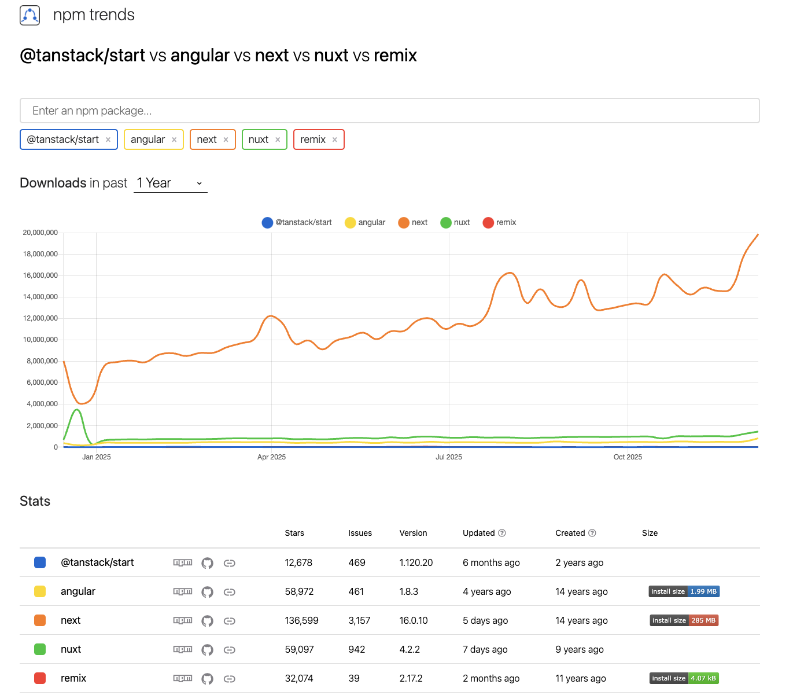

# 04. SSR

> 서버 사이드 렌더링의 정의와 함께 이를 리액트로 구현하는 방법까지 알아보자.

## 04.1. 서버 사이드 렌더링이란?

> 내 답변: 서버사이드 렌더링이란 웹서버가 존재하는 인스턴스 서버에서 HTML을 먼저 생성한 후 클라이언트로 HTML와 스크립트 파일을 함께 보내게 됩니다. 이때 HTML은 상호작용이 불가능한 단순 마크업 문서이지만 이후 클라이언트에서 자바스크립트 파일이 로드되면서 하이드레이션이 일어나게 되고, 이후 상호작용이 가능한 웹페이지로 변경됩니다. 서버에서 HTML을 생성할 수 있기 때문에 빈페이지와 스크립트 파일만 제공받아 클라이언트에서 페이지를 로드하는 SPA방식과는 다르게 웹 크롤러에게 서버에서 미리 만들어둔 메타데이터를 제공할 수 있으므로 SEO 또한 처리 가능하며 그 외 서버사이드 환경에서 데이터 로드 후 데이터에 알맞는 동적 HTML 생성 등 부수적인 처리도 가능합니다.

- 대충 프리스타일로 읊어봤는데 아직도 많이 부족해보이는 답변이네요

### 04.1.1. SPA의 세상

- SPA는 렌더링과 라우팅에 필요한 대부분의 기능을 서버가 아닌 클라이언트의 자바스크립트에 의존하는 방식을 의미합니다.
- 최초에 첫 페이지에서 데이터를 모두 불러온 이후에는 페이지 전환을 위한 모든 작업이 자바스크립트와 브라우저의 `history.pushState`와 `history.replaceState`로 이뤄지기 때문에 페이지를 불러온 이후에는 서버에서 HTML을 내려받지 않고 하나의 페이지에서 모든 작업을 처리하므로 싱글 페이지 애플리케이션이라고 합니다.
  - 일반적으로 웹에서 볼 수 있는 SPA 페이지의 HTML 코드를 개발자 도구로 확인해보면 `<body>`태그 내부에는 아무런 내용이 없습니다.
  - 이는 사이트 렌더링에 필요한 `<body>` 내부의 내용을 모두 자바스크립트 코드로 삽입한 이후에 렌더링하기 때문입니다.
  - 또 페이지 전환 시에도 새로운 HTML 페이지를 요청하는게 아니라 자바스크립트에서 다음 페이지의 렌더링에 필요한 정보만 HTTP 요청 등으로 가져온 다음, 그 결과를 바탕으로 `<body>` 내부에 DOM을 추가, 수정, 삭제하는 방법으로 페이지가 전환됩니다.
  - 즉, 최초에 서버에서 최소한의 데이터를 불러온 이후부터는 이미 가지고 있는 자바스크립트 리소스와 브라우저 API를 기반으로 모든 동작이 이루어집니다.
  - 이런 동작 방식에서는 최초에 로딩해야 할 자바스크립트 리소스가 커지는 단점이 존재하지만, 한번 로딩된 이후에는 서버를 거쳐 필요한 리소스를 받아 올 일이 적어지기 때문에 사용자에게 훌륭한 UI/UX를 제공한다는 장점이 있습니다.

#### 전통적인 방식의 애플리케이션과 SPA의 동작 비교

- 과거 서버 사이드에서 동작하던 전통적인 방식의 애플리케이션을 상상해보겠습니다. 지이이잉
  - 페이지 전환이 발생할 때마다 새롭게 페이지를 요청하고, HTML 페이지를 다운로드해 파싱하는 작업을 거치게 됩니다.
  - 페이지를 처음부터 새로 그려야 하는 방식으로 일부 사용자는 페이지가 전환될 때 부자연스러운 UI를 경험하게 됩니다.

#### 싱글 페이지 렌더링 방식의 유행과 JAM 스택의 등장

- 그렇다면 어쩌다 자바스크립트 위주의 CSR이 등장하게 된 것일까요?
  - 과거 PHP나🤢 JSP(Java server Pages)를🤮 기반으로 대부분의 웹 애플리케이션이 만들어졌을 때는 거의 대부분의 렌더링이 서버에서 이루어졌습니다.
    - 페이지를 요청하면 서버에서 완성된 HTML을 내려받고, 또 페이지 이동이 있으면 새로운 페이지를 서버에서 내려받는 방식이었습니다.
    - 여기서 자바스크립트는 어디까지나 사용자에게 추가적인 경험을 주기 위한 보조적인 수단으로 사용되었습니다.
    - 그러나 자바스크립트가 서서히 다양한 작업을 수행하게 되면서 자바스크립트를 모듈화 하는 방안이 점차 논의되기 시작했고 그에 따라 등장한 것이 CJS와 AMD 입니다.
    - 이러한 자바스크립트 모듈화의 결실, 그리고 하드웨어의 발전과 인터넷 속도의 발전 등으로 자바스크립트의 활용도가 점차 다양해지기 시작했습니다.
      > ESM이 나오기 이전 서버사이드에서 사용되었던 모듈타입 CJS와 브라우저 모듈타입 AMD는 알고있으면 유용한 내용입니다.
  - 2010년 경 Backbone.js와 AngularJS, Knockout.js 등이 등장하면서 자바스크립트 수준에서 MV\*\* 패턴의 프레임워크를 구현하기 시작했습니다.
  - 이는 자바스크립트에서도 어느 정도 서버에서만 할 수 있는 복잡한 작업을 할 수 있다는 것을 의미했고, 이때부터 자바스크립트의 역할과 규모가 점점 커져갔습니다.
    > 서버사이드를 활용 가능하다는 혹은 MVVM 패턴의 뷰모델을 구성할 수 있다는 내용으로 해석되네요
  - 프레임워크의 인기는 자바스크립트의 역할을 더욱 가중시켰고, 이후에는 우리가 잘 알고 있는 React, Vue, Angular의 시대가 찾아오게 됩니다.
- SPA, 즉 CSR이 널리 퍼지게 된 이유는 단순히 사용자에게 멋진 UX/UI를 제공하는 것이 가능해져서만은 아닙니다.
  - PHP 시절, 웹 애플리케이션을 만들기 위해서는 자바스크립트 외에도 신경 쓸 것이 많았지만, SPA에서는 단지 브라우저 내부에서 동작하는 자바스크립트만 잘 작성하면 문제 없습니다.
  - 즉, 프론트엔드 개발자들에게 더 간편한 DX를 제공하면서, 더욱 간편하게 웹 애플리케이션을 만들 수 있다는 장점이 존재합니다.
- 이러한 SPA의 유행으로 인해 새롭게 생겨난 용어가 바로 JAM 스택입니다.
  - 기존 레거시 웹 개발은 LAMP스택, 즉 Linux(OS), Apache(서버), MySQL(DB), PHP/Python 등(웹프레임워크)으로 구성되어 있었습니다
  - 이 LAMP 스택들은 레거시에서 매우 인기있는 웹 개발 구조이기도 했지만 동시에 어쩔 수 없는 선택지이기도 했습니다.
  - 과거 자바스크립트에서는 할 수 있는 일이 매우 제한적이었기 때문에 대부분의 처리를 서버에서 해야만 했습니다.
    - 그러나 이러한 서버 의존적인 문제는 웹 애플리케이션의 확장성에도 걸림돌로 작용했는데, 웹 애플리케이션의 기능이 다양해지거나 사용자가 늘어나면 이와 동시에 서버도 확장해야 했지만 클라우드 개념이 부족했던 이 당시에는 서버를 확장하는 것이 매우 어려운 사항이었습니다.
  - 이때 프레임워크의 등장으로 등장한것이 바로 JAM 스택입니다.
    - JavaScript, API, Markup
    - 대부분의 작업 수행이 자바스크립트로 가능했기 때문에 프론트엔드에서는 자바스크립트와 마크업(HTML, CSS)을 미리 빌드해두고 정적으로 사용자에게 제공하면 이후 동작은 모두 사용자의 클라이언트에서 실행되므로 서버 확장성 문제에서 조금 더 자유로워 질 수 있게 되었습니다.
    - 이러한 JAM 스택의 인기와 Node.js의 고도화에 힘입어 MEAN(MongoDB, Express,js, AngularJS, Node,js)이나 MERN(MongoDB, Express.js, React.js, Node.js) 스택처럼 아예 API 서버 자체도 자바스크립트로 구현하는 구조가 인기를 끌기 시작했습니다.

##### 모듈타입에 대하여 추가 정리

- [AMD, CommonJS, UMD 모듈 - ZeroCho Blog](http://zerocho.com/category/JavaScript/post/5b67e7847bbbd3001b43fd73)
- [Node 22.12.0부터는 CommonJS방식으로 ESM패키지 가져올 수 있다](https://github.com/toss/frontend-fundamentals/discussions/551)

#### 새로운 패러다임의 웹서비스를 향한 요구

- 먼저 이러한 자바스크립트 리소스의 증가로 인한 문제 발생이다. 눈에 띄는 점으로는 자바스크립트 파싱을 위해 CPU를 소비하는 시간이 눈에 띄게 증가했다는 점 입니다.
  - 자바스크립트의 절대적인 코드량이 증가했다는 내용입니다.
- 이로 인해 자바스크립트를 사용한 앱으로 개선을 했음에도 사용자들은 여전히 웹 애플리케이션의 로딩속도가 자바스크립트를 본격적으로 사용하기 이전 레거시 환경과는 크게 차이가 없거나 오히려 더 느리다는 문제가 제시되어 왔습니다.

### 04.1.2. SSR이란?

- SPA는 자바스크립트를 활용해 하나의 페이지에서만 렌더링을 수행한다면, SSR은 최초에 사용자에게 보여줄 페이지를 서버에서 렌더링해 빠르게 사용자에게 화면을 제공하는 방식을 의미합니다.
  - 웹페이지가 점점 느려지는 상황에 대한 문제의식을 SPA의 태생적인 한계에서 찾고, 이를 개선하고자 서버에서 페이지를 렌더링해 제공하는 기존의 방식을 채용하게 된 것입니다.
- CSR과 SSR의 차이는 웹페이지 렌더링의 책임을 어디에 두느냐 입니다.
  - CSR은 사용자에게 제공되는 자바스크립트 번들에서 렌더링을 담당하지만, SSR은 렌더링에 필요한 모든 작업을 모두 서버에서 수행합니다.

#### SSR의 장점

1.  최초 페이지 진입이 비교적 빠릅니다.
    - 물론 서버가 사용자에게 렌더링을 제공할 수 있을 정도의 충분한 리소스가 확보되어 있다는 가정하에 비교한 것 입니다. 만약 리소스 확보가 어렵다면 오히려 SPA방식보다 느려질 수 있습니다.
2.  검색엔진과 SNS 공유 등 메타데이터 제공이 쉽습니다.
    - 왜 SSR이 검색 엔진 최적화에 유용한지 이해하려면 먼저 검색 엔진이 사이트에서 필요한 정보를 가져가는 과정을 알아야 합니다.
      1. 검색 엔진 로봇(머신)이 페이지에 진입한다.
      2. 페이지가 HTML 정보를 제공해 로봇이 이 HTML을 다운로드한다. 단, 다운로드만 하고 자바스크립트 코드는 실행하지 않습니다.
      3. 다운로드한 HTML 페이지 내부의 Open Graph나 Meta 태그 정보를 기반으로 페이지의 검색(공유) 정보를 가져오고 이를 바탕으로 검색엔진에 저장한다.
    - 검색엔진 머신은 페이지의 정적인 정보만 가져오는 것이 목적이므로 자바스크립트를 다운로드하거나 실행할 필요가 없습니다.
      > 요즘 검색엔진 머신과 AI로 인해 발생하는 트래픽을 보면 디도스가 따로 없는듯 합니다.
3.  누적 레이아웃 이동이 적다
    - 레이아웃 쉬프트를 줄일 수 있다.
    - 하지만 이 또한 useEffect등을 떠올려 본다면, SSR도 완전히 자유롭지는 못하는 문제입니다.
4.  사용자의 디바이스 성능에 비교적 자유롭다.
5.  보안에 조금 더 안전하다.

    - JAM 스택을 채택한 프로젝트의 공통된 문제점은 애플리케이션의 모든 활동이 브라우저에 노출된다는 것 입니다.
    - 브라우저의 개발자 도구에 API 호출과 인증 같이 사용자에게 노출되면 안 되는 민감한 작업도 포함되므로 정상적인 비즈니스 로직을 거치지 않은 상황에서 인증이나 API가 호출되는 것을 항상 방지할 준비가 되어 있어야 합니다.
    - 반면 서버 사이드 렌더링의 경우 인증 혹은 민감한 작업을 서버에서 수행하고 그 결과만 브라우저에 제공하여 이러한 보안 위협을 피할 수 있다는 장점이 있습니다.

#### SSR의 단점

1. 소스코드를 작성할 때 항상 서버를 고려해야 합니다.

   - 브라우저 전역 객체인 window 또는 sessionStorage와 같이 브라우저에만 존재하는 전역 객체 등 입니다.
   - 서버에서 실행될 가능성이 있는 코드라면 window에 대한 접근을 최소화 해야 하고, window 사용이 불가피하다면 해당 코드가 서버사이드에서 실행되지 않도록 처리해야 합니다.
     > 이 외에도 서버에서 생성하는 인스턴스가 다른 사용자에게 공유되지 않도록 처리하는것도 존재하겠네요

2. 적절한 서버가 구축되어 있어야 합니다.

   > 저희는 클라우드플레어 wrangler환경을 사용하고 있습니다.
   > 다른분들은 웹서버 구성이 어떻게 되어있으신지 궁금합니다!

3. 서비스 지연에 따른 문제

### 04.1.3. SPA와 SSR을 모두 알아야 하는 이유

#### SSR은 역시 만능이 아니다.

> lazy load와 코드스플리팅은 재밋어

#### 현대의 서버 사이드 렌더링

    - 요즘의 SSR은 두 렌더링 방식의 장점을 취한 방식으도 동작합니다.
    - 먼저, 최초 웹사이트 진입 시에는 서버사이드 렌더링 방식으로 서버에서 완성된 HTML을 제공받고, 이후 라우팅에서는 서버에서 내려받은 자바스크립트를 바탕으로 마치 싱글페이지 애플리케이션처럼 동작합니다.

### 04.1.4. 정리

- 어떤 렌더링 방식이 옳다고 말할 수 없으므로 두 가지를 모두 이해하고 필요에 따라 알맞은 방법을 사용할 수 있습니다.
- 이를 위해서는 먼저 서버에서 React 코드가 어떻게 HTML로 변경되어 제공되는지, 그리고 이렇게 만들어진 HTML에 자바스크립트 코드를 어떻게 추가하는지를 알아야 합니다.

## 04.2. 서버 사이드 렌더링을 위한 리액트 API 살펴보기

- 기본적으로 리액트는 프론트엔드 라이브러리로 브라우저 자바스크립트 환경에서 렌더링할 수 있는 방법을 제공하지만 이와 동시에 리액트 애플리케이션을 서버에서 렌더링할 수 있는 API도 제공하고 있습니다.
- 해당 API는 Node.js와 같은 서버 런타임 환경에서만 실행할 수 있으며 리액트에서 서버사이드 렌더링을 실행할 때 사용되는 API를 확인해보려면 리액트 저장소의 `react-dom/server.js`를 확인해보면 됩니다.
  - react-dom이 서버에서 렌더링을 하기 위한 다양한 메서드를 제공하고 있습니다.

### 04.2.1. renderToString

- renderToString은 함수 이름에서 파악할 수 있듯이 인수로 넘겨받은 리액트 컴포넌트를 렌더링해 HTML 문자열로 반환하는 함수입니다.
- 서버사이드 렌더링을 구현하는 데 가장 기초적인 API로, 최초의 페이지를 HTML로 먼저 렌더링한다고 언급했는데 그 역할을 수행하는 함수입니다.

  ```tsx
  import ReactDOMServer from "react-dom/server";

  function ChildrenComponent({ fruits }: { fruits: Array<string> }) {
    useEffect(() => {
      console.log(fruits);
    }, [fruits]);

    function handleClick() {
      console.log("hello");
    }

    return (
      <ul>
        {fruits.map((fruit) => (
          <li key={fruit} onClick={handleClick}>
            {fruit}
          </li>
        ))}
      </ul>
    );
  }

  function SampleComponent() {
    return (
      <>
        <div>hello</div>
        <ChildrenComponent fruits={["apple", "banana", "peach"]} />
      </>
    );
  }

  const result = ReactDOMServer.renderToString(
    React.createElement("div", { id: "root" }, <SampleComponent />)
  );
  ```

  - 위 코드에서 result는 다음과 같은 문자열을 반환합니다.

  ```html
  <div id="root" data-reactroot="">
    <div>hello</div>
    <ul>
      <li>apple</li>
      <li>banana</li>
      <li>peach</li>
    </ul>
  </div>
  ```

  - 위 내용은 renderToString 함수를 사용해 실제 브라우저가 그려야 할 HTML을 생성한 모습입니다.
    - `ReactDOMServer.renderToString`으로 부모 컴포넌트인 `SampleComponent`를 렌더링했습니다.
    - 이 렌더링은 루트 컴포넌트인 `<div id="root" />`에서 수행됩니다. 그리고 결과로 완성된 HTML을 반환합니다.
  - 위 예시에서 한 가지 눈여겨볼 것은 useEffect와 같은 훅과 handleClick과 같은 이벤트 핸들러는 결괌ㄹ에 포함되지 않았다는 것 입니다.
    - 리액트에서 의도한 설계로, renderToString은 인수로 주어진 리액트 컴포넌트를 빠르게 브라우저가 렌더링 할 수 있는 HTML로 변환하여 제공하는데 목적이 있는 함수일 뿐 입니다.
    - 즉, 클라이언트에서 실행되는 자바스크립트 코드를 포함시키거나 렌더링하는 역할까지 해주지는 않습니다.
    - 필요한 자바스크립트 코드는 여기에서 생성된 HTML과는 별도로 브라우저에 제공해야 합니다.
  - 여기에서 한 가지 중요한 사실은 리액트의 서버 사이드 렌더링은 단순히 "최초 HTML페이지를 빠르게 그려주는 데"에 목적이 있다는 것 입니다.
    - 사용자는 완성된 HTML을 빠르게 받아 볼 수 있지만, useEffect와 이벤트핸들러 등의 웹페이지와 사용자와의 인터렉션이 준비되기 위해서는 이와 관련된 별도의 자바스크립트 코드를 모두 다운로드, 파싱, 실행하는 과정을 거쳐야 합니다.
  - 마지막으로 주목해야 할 부분은 `div#root`에 존재하는 속성은 `data-reactroot`입니다.
    - 이 속성은 리액트 컴포넌트의 루트 엘리먼트가 무엇인지 식별하는 역할을 합니다.
    - 이 속성은 이후에 자바스크립트를 실행하기 위한 **hydrate** 함수에서 루트를 식별하는 기준점이 됩니다.
    - 리액트로 만들어진 애플리케이션을 보면 리액트의 루트 엘리먼트에 `data-reactroot`속성이 있는 것을 확인할 수 있습니다.

### 04.2.2. renderToStaticMackup

- renderToStaticMarkup 함수는 renderToString과 매우 유사한 함수입니다.

  - 두 함수 모두 리액트 컴포넌트를 기준으로 HTML 문자열을 만든다는 점에서 동일합니다.
  - 한 가지 유의미한 차이점은 앞서 루트 요소에 추가한 `data-reactroot`와 같은 리액트에서만 사용하는 추가적인 DOM 속성을 만들지 않는다는 점입니다.
  - 위 내용처럼 리액트에서만 사용하는 속성을 제거하면 결과물인 HTML의 크기를 아주 약간이라도 줄일 수 있다는 장점이 존재합니다.

- 반대로 이야기하면 renderToStaticMarkup함수를 실행한 결과로 렌더링을 수행하면 클라이언트에서는 리액트에서 제공하는 useEffect와 같은 브라우저 API를 절대로 실행할 수 없습니다.
- 만약 renderToStaticMarkup의 결과물을 기반으로 리액트의 자바스크립트 이벤트리스너를 등록하는 `hydrate`를 수행하면 서버와 클라이언트의 내용이 맞지 않는다는 에러가 발생합니다.
  - 그 이유는 `hydrate`를 수행하지 않는다는 가정하에 순수한 HTML만 반환하기 때문입니다.
  - 결과적으로는 `hydrate`를 수행해도 클라이언트에서 완전히 새롭게 렌더링하게 됩니다.
- 결론적으로 renderToStaticMarkup은 리액트의 이벤트 리스너가 필요 없는 완전히 순수한 HTML을 만들 때만 사용하게 되며, 블로그 혹은 상품의 약관 정보와 같이 브라우저 액션이 없는 정적인 내용이 필요한 경우에 유용합니다.

### 04.2.3. renderToNodeStream

- renderToNodeStream은 renderToString과 결과물이 완전히 동일하지만 두 가지 차이점이 존재합니다.
  - 첫 번째 차이점으로는 앞서 살펴 본 두 API인 renderToString과 renderToStaticMarkup은 브라우저에서도 실행할 수는 있지만, renderToNodeStream은 브라우저에서 실행하면 아래와 같은 에러가 나옵니다.
    `ReactDOMServer.renderToNodeStream(): // 대충 에러 내용`
    - 물론 해당 챕터에서 언급중인 함수들을 브라우저 환경에서 실행할 이유도 없지만 네이밍에서 파악할 수 있듯이 완전히 Node.js환경에 의존하고 있는 함수입니다.
  - 두 번째 차이점은 결과물의 타입입니다.
    - renderToString은 이름에서도 알 수 있듯 결과물이 string인 문자열이지만, renderToNodeStream의 결과물은 Node.js의 `ReadableStream`입니다.
      - ReadableStream은 utf-8로 인코딩된 바이트 스트림으로, Node.js 환경에서만 사용할 수 있습니다.
      - 궁극적으로 브라우저가 원하는 결과물인 string을 얻기 위해서는 추가적인 처리가 필요합니다.
- 그렇다면 renderToNodeStream은 왜 필요할까요?
  - 먼저 스트림의 개념을 이해하고 넘어가겠습니다.
    - 유튜브와 같은 웹에서 동영상을 보는 상황에서는 유튜브 영상을 보기 위해 전체 영상을 모두 다운로드 할 때까지 기다리지 않습니다.
    - 사용자가 볼 수 있는 몇 초라도 먼저 다운로드되면 그 부분을 먼저 보여주고, 이후에 계속해서 영상을 다운로드 합니다.
    - 스트림은 큰 데이터를 다룰 때 데이터를 청크(chunk, 작은 단위)로 분할해 조금씩 가져오는 방식을 의미합니다.
  - renderToString이 생성하는 HTML결과물의 크기가 작다면 한 번에 생성하거나 스트림으로 처리하거나 문제가 되지 않지만, 매우 큰 결과물이 필요한 상황이라면 크기가 큰 문자열을 한 번에 메모리에 올려두고 응답을 수행해야 하는 Node.js가 실행되는 서버에 큰 부담이 될 수 있습니다.
  - 이러한 경우 스트림을 활용해서 거대한 크기의 데이터를 청크 단위로 분리하고 순차적으로 처리할 수 있다는 장점이 있습니다.
    - 스트림 대신 renderToString을 사용한다면 HTTP응답으로 거대한 HTML 파일이 완성될 때까지 기다려야 하지만, 스트림으로 처리한다면 HTML이 여러 청크로 분리되어 내려오게 되는 것 입니다.
  - 스트립을 활용하여 HTML을 작은 단위로 쪼개 연속적으로 작성함으로써 Node.js 서버의 부담을 덜어주는 방식입니다.
- 대부분의 널리 알려진 리액트 서버사이드 렌더링 프레임워크에서는 모두 renderToString대신 renderToNodeStream을 채택하고 있습니다.

### 04.2.4. renderToStaticNodeStream

- renderToString에 renderToStaticMarkup이 있다면 renderToNodeStream에는 renderToStaticNodeStream이 있습니다.
- renderToNodeStream과 제공되는 결과물이 동일하나 마찬가지로 리액트 자바스크립트에 필요한 리액트 속성이 제공되지 않습니다.
- 마찬가지로 hydrate를 할 필요가 없는 순수 HTML 결과물이 필요할 때 사용하는 메서드입니다.

### 04.2.5. hydrate ⭐️⭐️⭐️⭐️⭐️

- hydrate함수는 앞서 살펴 본 두 개의 함수 renderToString과 renderToNodeStream으로 생성된 HTML 콘텐츠에 자바스크립트 핸들러나 이벤트를 붙이는 역할을 합니다.
  - 앞서 언급한 것처럼 renderToString의 결과물은 단순 HTML 결과물로 사용자에게 UI를 제공하지만 사용자가 페이지와 인터렉션을 하는 것을 불가능합니다.
  - hydrate는 이처럼 정적 HTML에 이벤트와 핸들러를 붙여 완전한 웹페이지 결과물을 만들어줍니다.
- hydrate에 대해 설명하기에 앞서 hydrate와 비슷한 브라우저에서만 사용되는 메서드인 render함수를 먼저 살펴보겠습니다.

  ```tsx
  import * as ReactDOM from "react-dom";
  import App from "./App";

  const rootElement = document.getElementById("root");

  ReactDOM.render(<App />, rootElement);
  ```

  - render함수는 컴포넌트와 HTML의 요소를 인수로 받습니다.
  - 이렇게 인수로 받은 두 정보를 바탕으로 HTML의 요소에 해당 컴포넌트를 렌더링하며, 여기에 이벤트 핸들러를 붙이는 작업까지 모두 한 번에 수행합니다.
  - render는 클라이언트 컴포넌트에서만 실행되는, 렌더링과 이벤트 핸들러 추가 등 리액트를 기반으로 온전한 웹페이지를 만드는 데 필요한 모든 작업을 수행합니다.

- hydrate는 render 함수와 인수를 넘겨받는 것이 매우 유사합니다.

  ```tsx
  import * as ReactDOM from "react-dom";
  import App from "./App";

  // containerId를 가리키는 element는 서버에서 렌더링된 HTML의 특정 위치를 의미한다.
  const element = document.getElementById(containerId);
  // 해당 element를 기준으로 리액트 이벤트 핸들러를 붙인다.
  ReactDOM.hydrate(<App />, element);
  ```

  - render와의 차이점은 hydrate는 기본적으로 이미 렌더링된 HTML이 있다는 가정 하에 작업이 수행되고, 이 렌더링된 HTML을 기준으로 이벤트를 붙이는 작업만 실행한다는 것 입니다.
  - 이때, rootElement 내부에는 `<App />`을 렌더링한 정보가 이미 포함되어 있어야만 hydrate를 실행할 수 있습니다.
  - 따라서 hydrate는 두 번째로 주입받는 인수에서는 이미 renderToString 등으로 렌더링된 정적인 HTML이 받드시 담겨있어야 의도대로 동작한다는 점 입니다.
  - 아무것도 없는 빈 HTML에 정보를 렌더링하는 render함수와의 차이점이 바로 이것입니다.

### 04.2.6. 서버 사이드 렌더링 예제 프로젝트

- 앞서 살펴본 함수들이 어떻게 실행되는지 알아보기 위해 간단한 리액트 SSR 예제 애플리케이션을 만들어보겠습니다.
  - 먼저 우리가 사용하는 대부분의 애플리케이션에서는 자바스트립트 이벤트 핸들러가 필요하므로 정적인 HTML 결과물만 반환하는 `renderToStaticMarkup`과 `renderToStaticNodeStream`에 대해서는 다루지 않습니다.
- 예제의 구조를 간단하게 정의해보겠습니다.

  1. 특정 `/api`에서 할 일 목록을 가져온다.
  2. 각 할 일을 클릭해 useState로 완료 여부를 변경할 수 있는 구조를 갖는다.

- 해당 예제에서 SSR을 활용해서 서버사이드에서 먼저 할 일 목록을 불러온 뒤 이를 완성한 HTML을 클라이언트에 제공한 뒤, 클릭 이벤트 핸들러를 추가하는 구조를 만들어보겠습니다.

#### 1. index.tsx

- index.tsx 파일은 create-react-app의 index.jsx와 유사한 역할을 하는 애플리케이션의 시작접으로 hydrate를 포함하고 있습니다.

  ```tsx
  import { hydrate } from "react-dom";

  import App from "./components/App";
  import { fetchTodo } from "./fetch";

  async function main() {
    const result = await fetchTodo();

    const app = <App todos={result} />;
    const el = document.getElementById("root");

    hydrate(app, el);
  }

  main();
  ```

  - index.tsx 파일의 목적은 서버로부터 받은 HTML을 hydrate를 통해 완성된 웹 애플리케이션으로 만들어주는 것 입니다.
  - 한 가지 눈에 띄는 점은 fetchTodo를 호출해 필요한 데이터를 주입해주는 부분 입니다.
    - 앞서 이야기 한 것처럼 hydrate는 서버에서 완성한 HTML과 하이드레이션 대상이 되는 HTML의 결과물이 동일한지 비교하는 작업을 거치므로, 이 비교 작업을 무사히 수행하기 위해 한 번 더 데이터를 조회하게 됩니다.

#### 2. App.tsx

- App.tsx는 일반적으로 사용자가 만드는 리액트 애플리케이션의 시작점입니다.
- 한 가지 다른 점은 todos를 props로 받는데, 이 props는 서버에서 요청하는 todos를 받습니다. 이 props.todo를 기반으로 렌더링하는 평범한 컴포넌트 입니다.

  ```tsx
  import { useEffect } from "react";
  import { TodoResponse } from "../fetch";
  import { Todo } from "./Todo";

  export default function App({ todos }: { todos: Array<TodoResponse> }) {
    useEffect(() => {
      console.log("하이!");
    }, []);

    return (
      <>
        <h1>나의 할 일!</h1>
        <ul>
          {todos.map((todo, index) => (
            <Todo key={index} todo={todo} />
          ))}
        </ul>
      </>
    );
  }
  ```

#### 3. Todo.tsx

- 마지막으로 Todo.tsx는 App.tsxㅇ의 자식 컴포넌트로, props.todo를 받아 렌더링하는 역할을 합니다.
- 그 외에는 일반적으로 볼 수 있는 리액트 컴포넌트와 동일한 모습을 갖추고 있습니다.

  ```tsx
  import { useState } from "react";
  import { TodoResponse } from "../fetch";

  export function Todo({ todo }: { todo: TodoResponse }) {
    const { title, completed, userId, id } = todo;
    const [finished, setFinished] = useState(completed);

    function handleClick() {
      setFinished((prev) => !prev);
    }

    return (
      <li>
        <span>
          {userId}-{id} {title} {finished ? "완료" : "미완료"}
          <button onClick={handleClick}>토글</button>
        </span>
      </li>
    );
  }
  ```

#### 4. index.html

- 해당 HTML 파일은 SSR을 수행할 때 기본이 되는 HTML 템플릿 입니다.
- 해당 HTML을 기반으로 리액트 애플리케이션이 완성됩니다.
  ```html
  <!DOCTYPE html>
  <html>
    <head>
      <meta charset="utf-8" />
      <meta name="viewport" content="width=device-width, initial-scale=1.0" />
      <title>SSR Example</title>
    </head>
    <body>
      __placeholder__
      <script src="https://unpkg.com/react@17.0.2/umd/react.development.js"></script>
      <script src="https://unpkg.com/react-dom@17.0.2/umd/react-dom.development.js"></script>
      <script src="/browser.js"></script>
    </body>
  </html>
  ```
  - 다만 일반적인 HTML과는 다른 몇 가지 주목할 포인트가 존재합니다.
    - `__placeholder__`는 서버에서 리액트 컴포넌트를 기반으로 만든 HTML 코드를 삽입하는 자리입니다.
      단순히 이 부분을 결과물로 대체해서 리액트에서 만든 HTML을 삽입을 하게 될 것입니다.
      물론 다른 프레임워크에서는 이렇게 단순한 방식으로 처리하는 않지만 예제에서는 직관적인 이해를 돕기 위해 추가해 두었습니다.
    - `unpkg`은 npm라이브러리를 CDN으로 제공하는 웹 서비스입니다.
      여기에 react와 react-dom을 추가해두었습니다.
      - 정상적인 프레임워크라면 클라이언트에서 필요한 의존성 패키지를 웹팩과 같은 도구로 번들링해 제공하는것이 일반적입니다.
      - create-react-app을 빌드하게 되었을 때 나오는 결과물인 main.js 파일이 이러한 역할을 하는 파일입니다.
      - 그러나 이 역히 예제에서는 이해를 돕기 위해 간단하게 처리했습니다.
    - `browser.js`는 클라이언트 리액트 애플리케이션 코드를 번들링했을 때 제공되는 리액트 자바스트립트 코드입니다.
      내부에는 App.tsx Todo.tsx fetch등의 자바스크립트 코드가 포함되어 있습니다.
      즉, `__placeholder__` 자리에 먼저 리액트에서 만든 HTML이 삽입되면 이후에 이 코드가 실행되면서 필요한 자바스크립트 이벤트 핸들러가 붙을 것 입니다.

#### 5. server.ts - 이제부터는 본격적으로 서버 코드를 살펴보겠습니다.

- 서버에서는 사용자의 요청 주소에 따라 어떠한 리소스를 내려줄지 결정하는 역할을 합니다.
- 특히 서버 사이드 렌더링을 위해 이 파일에서 리액트 트리를 만드는 역할도 담당하게 됩니다.

  ```tsx
  import { createServer, IncomingMessage, ServerResponse } from 'http'
  import { createReadStream } from 'fs'

  import { renderToNodeStream, renderToString } from 'react-dom/server'
  import { createElement } from 'react'

  import html from '../public/index.html'
  import indexFront from '../public/index-front.html'
  import indexEnd from '../public/index-end.html'

  import App from './components/App'
  import { fetchTodo } from './fetch'

  const PORT = process.env.PORT || 3000

  async function serverHandler(req: IncomingMessage, res: ServerResponse) {
    const { url } = req

    switch (url) {
      // renderToString을 사용한 서버 사이드 렌더링
      case '/': {
        const result = await fetchTodo()

        const rootElement = createElement(
          'div',
          { id: 'root' },
          createElement(App, { todos: result }),
        )

        const renderResult = renderToString(rootElement)

        const htmlResult = html.replace('__placeholder__', renderResult)

        res.setHeader('Content-Type', 'text/html')
        res.write(htmlResult)
        res.end()

        return
      }

      // renderToNodeStream을 사용한 서버 사이드 렌더링
      case '/stream': {
        res.setHeader('Content-Type', 'text/html')
        res.write(indexFront)

        const result = await fetchTodo()
        const rootElement = createElement(
          'div',
          { id: 'root' },
          createElement(App, { todos: result }),
        )

        const stream = renderToNodeStream(rootElement)
        stream.pipe(res, { end: false })
        stream.on('end', () => {
          res.write(indexEnd)
          res.end()
        })
      }

        return
      }

      // 브라우저에 제공되는 리액트 코드
      case '/browser.js': {
        res.setHeader('Content-Type', 'application/javascript')
        createReadStream('./dist/browser.js').pipe(res)
        return
      }

      // 위 파일의 소스맵
      case '/browser.js.map': {
        res.setHeader('Content-Type', 'application/javascript')
        createReadStream('./dist/browser.js.map').pipe(res)
        return
      }

      default: {
        res.statusCode = 404
        res.end('404 Not Found')
      }
    }
  }

  function main() {
    createServer(serverHandler).listen(PORT, () => {
      console.log(`Server has been started ${PORT}...`) // eslint-disable-line no-console
    })
  }

  main()
  ```

  - createServer

    - createServer는 http모듈을 이용해 간단한 서버를 만들 수 있는 Node.js 기본 라이브러리 입니다.
    - 코드 흐름 상 이해해보면 3000번 포트를 이용하는 HTTP서버를 만들었다고 볼 수 있습니다.

  - serverHandler

    - serverHandler는 createServer로 넘겨주는 인수로, HTTP 서버가 라우트별로 어떻게 동작할지를 정의하는 함수입니다.
    - req.url을 통해 사용자가 접근한 주소를 알 수 있는데, 각 주소별로 어떻게 동작할지 정의할 수 있습니다.

  - server.ts의 루트 라우터 `/`

    - 사용자가 루트 라우터 경로로 접근했을 때 실행되는 코드입니다.

    ```ts
    const result = await fetchTodo();
    const rootElement = createElement(
      "div",
      { id: "root" },
      createElement(App, { todos: result })
    );

    const renderResult = renderToString(rootElement);

    const htmlResult = html.replace("__placeholder__", renderResult);

    res.setHeader("Content-Type", "text/html");
    res.write(htmlResult);
    res.end();

    return;
    ```

    - 이 라우팅에서는 renderToString을 활용해 리액트 컴포넌트를 HTML로 만들었고, 이를 앞서 언급한 `__placeholder__`를 대상으로 replace를 실행하여 서버 응답으로 제공합니다.
    - 서버사이드에서 완벽하게 렌더링 가능한 하나의 HTML을 만들어 제공하는 SSR의 목적을 이 라우트로 조건을 달성하고 있습니다.

  - server.ts의 `/stream` 라우터

    - 이 코드도 rootElement를 만드는 과정까지는 동일합니다.

    ```ts
    switch (url) {
      case "/stream": {
        res.setHeader("Content-Type", "text/html");
        res.write(indexFront);

        const result = await fetchTodo();
        const rootElement = createElement(
          "div",
          { id: "root" },
          createElement(App, { todos: result })
        );

        const stream = renderToNodeStream(rootElement);
        stream.pipe(res, { end: false });
        stream.on("end", () => {
          res.write(indexEnd);
          res.end();
        });

        return;
      }
    }
    ```

    - 한 가지 주목할 부분은 `res.write(indexFront)`와 `res.write(indexEnd)`, 그리고 그 사이에 존재하는 `renderNodeStream` 입니다.
      - 먼저 indexFront와 indexEnd는 앞서 소개한 index.html의 `__placeholder__` 부분을 반으로 나눈 코드입니다.
      - index.html의 앞선 절반을 우선 응답으로 기록하고, 이후에 renderToNodeStream을 활용해 나머지 부분을 스트림 형태로 생성했습니다.
      - 스트림은 renderToString처럼 한 번에 결과물을 만들지 않고 청크 단위로 생성하기 때문에 이를 pipe와 res에 걸어두고 청크가 생성될 때마다 res에 기록하게 됩니다.

## 04.3. Next.js 톺아보기


