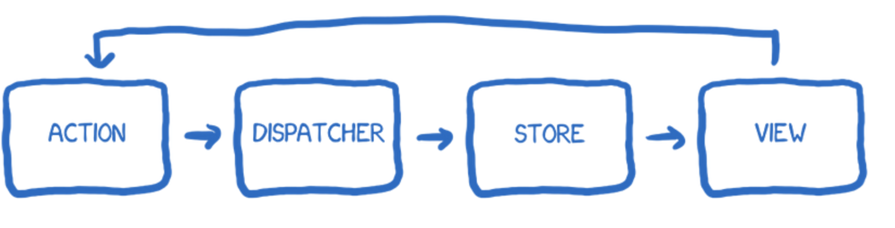
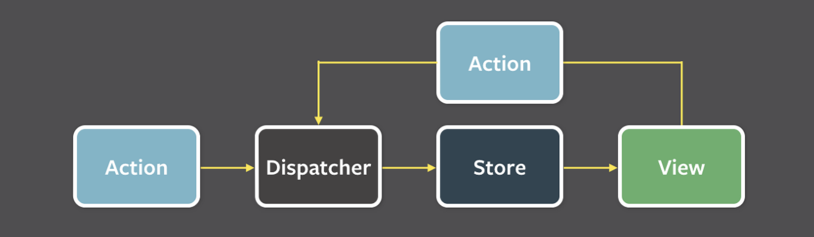

# 05. 리액트와 상태 관리 라이브러리

## 05.1. 상태 관리는 왜 필요한가?

- 먼저 상태 관리에 대해 이야기하기에 앞서 이제 앞으로 계속해서 이야기할 "상태"란 무엇인지 정의할 필요가 있습니다.
- 흔히 웹 애플리케이션을 개발할 때 이야기하는 **상태는 어떠한 의미를 지닌 값이며 애플리케이션의 시나리오에 따라 지속적으로 변경될 수 있는 값을 의미합니다.**
- 웹 애플리케이션에서 상태로 분류될 수 있는 것들은 대표적으로 다음과 같은 것이 있습니다.
  - UI: 기본적으로 웹 애플리케이션에서 상태라 함은 상호 작용이 가능한 모든 요소의 현재 값을 의미한다.
    다크/라이트 모드, 라디오를 비롯한 각종 input, 알림창의 노출 여부 등 많은 종류의 상태가 존재합니다.
  - URL: 브라우저에서 관리되고 있는 상태값으로, 여기에도 우리가 참고할 만한 상태가 존재할 수 있습니다.
    params, searchParams 등의 상태가 존재하며 이 상태는 사용자의 라우팅에 따라 변경됩니다.
  - 폼(form): 폼에도 상태가 존재합니다.
    로딩중인지(loading), 현재 제출되었는지(submit), 접근이 불가능한지(disabled), 값이 유효한지(validation) 등 모두가 상태로 관리됩니다.
    
    > form 사용시 유저 플로우에 따른 field state를 세부적으로 나눠놓은 api가 있어 가져와 봤습니다.
  - 서버에서 가져온 값: 클라이언트에서 서버로 요청을 통해 가져온 값도 상태로 볼 수 있습니다.
    대표적으로 API요청이 있습니다.
- 웹 서비스에서 점차 다양한 기능이 제공됨에 따라 웹 내부에서 관리해야 할 상태도 점차 비례해서 증가하고 있습니다.
- 만약 애플리케이션 전체적으로 괸리해야 할 상태가 존재한다면, 그리고 그 상태에 따라 다양한 요소들이 각 상태에 알맞는 UI를 보여줘야 한다면 상태를 어디에서 어떻게 관리할 것인가? 등에 대한 외면할 수 없는 주제들로 인해 상태를 효율적으로 관리하고, 상태가 필요한 곳에서는 빠르게 반응할 수 있는 모델에 대한 고민이 본격적으로 이루어지기 시작했습니다.

### 05.1.1. 리액트 상태 관리의 역사

- 리액트 또한 다른 웹 개발 환경과 마찬가지로 상태 관리에 대한 필요성이 존재했습니다.
- **개발에 필요한 모든 환경을 제공해주는 프레임워크와는 달르게 리액트는 단순히 사용자 인터페이스를 만들기 위한 라이브러리 일 뿐이고,** 그 이상의 기능을 제공하지 않고 있습니다.
- 이제부터는 리액트 개발자들이 상태 관리를 하기 위해 어떤 온몸비틀기를 해왔는지에 대해서 살펴보겠습니다.

#### Flux 패턴의 등장

- 리액트에서는 상태관리, 특히 전역 상태 관리를 어떻게 했을까요?
- 순수 리액트의 상태 관리 수단이라고 한다면 Context API를 떠올릴 것 입니다.
  > **엄밀히 이야기한다면 리액트에서 Context API는 상태 관리가 아닌 상태 주입을 도와주는 역할입니다.**
  > 또한 Context API가 출시된 것은 16.3, useContext가 출시된 것은 16.8 버전이었습니다.
  > 그 전까지는 리덕스가 나타나기 전까지 리액트 애플리케이션에서 딱히 이름을 널리 알린 상태관리 라이브러리는 존재하지 않았습니다.
- 2014년경, 리액트와 등장과 비슷한 시기에 Flux 패턴과 함께 이를 기반으로 한 라이브러리인 Flux를 소개하게 됩니다.
- Flux를 소개하기에 앞서 먼저 당시 웹 개발 환경을 먼저 이야기해보겠습니다.
  - 웹 애플키레이션이 비대해지고 상태(데이터)도 많아짐에 따라 어디에서 어떤 일이 발생해서 이 상태가 변했는지 등을 추적하고 이해하기가 매우 어려운 상황이었습니다.
  - 페이스북 팀은 이러한 문제의 원인을 양방향 데이터 바인딩으로 보았지요. 양방향 바인딩에서는 뷰(HTML)가 모델(자바스크립트)을 변경할 수 있으며, 반대의 경우 모델도 뷰를 변경할 수 있습니다.
    - 코드를 작성하는 입장에서는 간단할 수 있지만 코드의 양이 많아지고 변경 시나리오가 복잡해질수록 관리가 어려워진다는 단점이 존재합니다.
  - 페이스북 팀은 양방향이 아닌 단방향으로 데이터 흐름을 변경하는 것을 제안하는데 이것이 바로 Flux 패턴의 시작입니다.



- 각 용어를 톺아보겠습니다.
  - 액션(action): 어떠한 작업을 처리할 액션과 그 액션 발생 시 함께 포함시킬 데이터를 의미합니다. 액션 타입과 데이터를 각각 정의해 이를 디스패처로 보내게 됩니다.
  - 디스패처(dispatcher): 액션을 스토어에 보내는 역할을 합니다. 콜백 함수 형태로 앞서 액션이 정의한 타입과 데이터를 모두 스토어에 보내게 됩니다.
  - 스토어(store): 여기에서 실제 상태에 따른 값과 상태를 변경할 수 있는 메서드를 가지고 있습니다. 액션 타입에 따라 어떻게 이를 변경할지가 정의되어 있습니다.
  - 뷰(view): 리액트의 컴포넌트에 해당하는 부분으로, 스토어에서 만들어진 데이터를 가져와 화면을 렌더링하는 역할을 합니다.
    또한 뷰에서도 사용자의 입력이나 행위에 따라 상태를 업데이트 하고자 할 수 있을 것 입니다. 이 경우 아래 그림처럼 뷰에서 액션을 호출하는 구조로 구성됩니다.
    
- 단방향 데이터 흐름 방식은 단점으로는 사용자의 상호작용에 따라 데이터를 갱신하고 화면을 어떻게 업데이트해야 하는지도 코드로 작성해야 하므로 코드의 양이 많아지고 개발자도 번거로운 작업을 진행해야 합니다.
- 그러나 데이터 흐름은 모두 액션이라는 한 방향(단방향)으로 즐어듦으로 인해 데이터의 흐름을 추적하기 쉽고 코드를 이해하기가 한결 수월해집니다.
- 리액트는 대표적인 단방향 데이터 바인딩을 기반으로 한 라이브러리였으므로 이러한 단방향 흐름을 정의하는 Flux 패턴과 매우 궁합이 잘 맞았습니다.
- 상태와 그 상태의 변경에 대한 흐름과 방식을 단방향으로 채택한 것이 바로 리액트 기반 Flux의 특징이라고 볼 수 있습니다.

#### 시장 지배자 리덕스의 등장 🤮

- 리액트와 단방향 데이터 흐름이 점점 두각을 드러내던 와중에 등장한 것이 바로 Redux입니다. 🤢
- Redux또한 최초에는 Flux 구조를 구현하기 위해 만들어진 라이브러리 중 하나였습니다. 한 가지 특별한 부분은 여기에 Elm 아키텍처를 도입했다는 것 입니다.
- Elm은 웹페이지를 선언적으로 작성하기 위한 언어입니다.
  - Elm에서는 Flux와 마찬가지로 데이터 흐름을 세 가지로 분류하고, 이를 단방향으로 강제하여 웹 애플이케이션의 상태를 관리하고자 노력했습니다.
  - 그리고 Redux는 Elm 아키텍처의 영향을 받아 작성되었습니다.
- 리덕스는 하나의 상태 객체를 스토어에 저장해두고, 이 객체를 업데이트하는 작업을 디스패치하여 업데이트를 수행합니다.
- 이러한 작업은 reducer함수로 발생시킬 수 있는데, 이 함수의 실행은 웹 애플리케이션 상태에 대한 완전히 새로운 복사본을 반환한 다음, 애플리케이션에 이 새롭게 만들어진 상태를 전파하게 됩니다.

## 05.2. 리액트 훅으로 시작하는 상태관리

### 05.2.1. 가장 기본적인 방법: useState와 useReducer

- 지역 상태 관리는 여러 컴포넌트에 걸쳐 상태를 공유하기 위해서는 텀포넌트 트리를 재설계하는 등의 수고로운이 필요합니다.

### 05.2.2. 지역 상태의 한계를 벗어나보자: useState의 상태를 바깥으로 분리하기

- 여러가지 여건과 기능적 구조적 한계를 종합해 본다면 함수 외부에서 상태를 참조하고 이를 통해 렌더링까지 자연스럽게 일어나기 위해서는 다음과 같은 조건을 만족해야 한다는 결론에 도달합니다.
  1. 꼭 window혹은 global에 있어야 할 필요는 없지만 컴포넌트 외부 어딘가에 상태를 두고 여러 컴포넌트가 같이 사용할 수 있어야 한다.
  2. 이 외부에 있는 상태를 사용하는 컴포넌트는 상태의 변화를 알아챌 수 있어야 하고 상태가 변화될 때마다 리렌더링이 일어나서 컴포넌트를 최신 상태값 기준으로 렌더링해야 한다.
     이 상태 감지는 상태를 변경시키는 컴포넌트 뿐만 아니라 상태를 참조하는 모든 컴포넌트에서 동일하기 동작해야 한다.
  3. 상태가 원시값이 아닌 객체인 경우 그 객체에 내가 감지하지 않는 값이 변한다 하더라도 리렌더링이 발생해서는 안된다.
     예를 들어, `{a:1 , b:2}`라는 상태가 있으며 어느 컴포넌트에서 a의 값을 업데이트 했을 경우 객체 값의 변화가 단순히 b의 값을 참조하는 컴포넌트에서는 리렌더링을 일으켜서는 안된다는 뜻이다.

### 05.2.4. 상태 관리 라이브러리 Recoil, Jotai, Zustand 살펴보기

- Recoil과 Jotai는 Context와 Provider, 그리고 훅을 기반으로 가능한 작은 상태를 효율적으로 관리하는데 초점을 맞추고 있습니다.
- Zustand는 리덕스와 유사하게 하나의 큰스토어를 기반으로 상태를 관리하는 라이브러리 입니다.
  - Recoil과 Jotai와는 다르게 이 하나의 큰 스토어는 Context가 아니라 스토어가 가지는 클로저를 기반으로 생성되며, 이 스토어의 상태가 변경되면 이 상태를 구독하고 있는 컴포넌트에 전파해 리렌더링을 알리는 방식입니다.
- 해당 챕터에서는 세 상태 관리 라이브러리가 지향하는 목적은 무엇이고, 라이브러리 내부에서는 어떻게 상태를 관리하며, 나아가 이 상태를 각 컴포넌트로 어떻게 전해하여 렌더링을 일으키는지와 같은 핵심적인 요소만 살펴보려고 합니다. 🥰
  > 만약 세 라이브러리에 대한 자세한 API 및 사용 예제가 궁금하다면 각 라이브러리의 홈페이지와 깃허브 저장소를 참고하시면 됩니다!

#### 페이스북이 만든 상태 관리 라이브러리 Recoil

- Recoil은 리액트를 만든 페이스북에서 만든 리엑트를 위한 상태 관리 라이브러리 입니다.
- 리액트에서 훅의 개념으로 상태 관리를 시작한 최초의 라이브러리중 하나이며, 최소 상태 개념인 Atom을 처음 리액트 생태계에서 선보이기도 했습니다.
- 2020년 처음 출시되었지만 깃허브에서 알 수 있듯 아직 정식으로 출시한 라이브러리가 아닌 실험적으로 개발되고 운영되는 라이브러리 입니다.
- 비록 정식 출시된 라이브러리는 아니지만 Recoil에서 제공하는 구현 방식은 다른 라이브러리에도 많은 영향을 끼쳤기 때문에 가장 먼저 Recoil에 대해서 톺아보겠습니다.

##### RecoilRoot

- 가장 먼저 Recoil을 사용하기 위해서는 RecoilRoot을 애플리케이션 최상단에 선언해주어야 합니다.

```tsx
export default function App() {
  return <RecoilRoot>{/* some components */}</RecoilRoot>;
}
```

- Recoil의 소스코드를 살펴보면 RecoilRoot에서 Recoil이 생성되는 상태값을 저장하기 위한 스토어를 생성하는 것을 확인할 수 있습니다.

```tsx
function RecoilRoot(props: Props): React.Node {
  const { override, ...propsExceptOverride } = props;

  const ancestorStoreRef = useStoreRef();
  if (override === false && ancestorStoreRef.current !== defaultStore) {
    // If ancestorStoreRef.current !== defaultStore, it means that this
    // RecoilRoot is not nested within another.
    return props.children;
  }

  return <RecoilRoot_INTERNAL {...propsExceptOverride} />;
}
```

- 여기에서 주목할 포인트는 `useStoreRef`입니다.

  - `useStoreRef`를 통해 `ancestoreStoreRef`의 존재를 확인하는데, 이는 Recoil에서 생성되는 atom과 같은 상태값을 저장하는 스토어를 의미합니다.
  - 그리고 이 `useStoreRef`가 가리키는 것은 다름 아닌 `AppContext`가 가지고 있는 스토어 입니다.

  ```tsx
  const AppContext = React.createContext<StoreRef>({ current: defaultStore });
  const useStoreRef = (): StoreRef => useContext(AppContext);
  ```

  - 그리고 스토어의 기본값을 의미하는 defaultStore는 다음과 같습니다.

  ```ts
  function notInAContext() {
    throw err("This component must be used inside a <RecoilRoot> component.");
  }

  const defaultStore: Store = Object.freeze({
    storeID: getNextStoreID(),
    getState: notInAContext,
    replaceState: notInAContext,
    getGraph: notInAContext,
    subscribeToTransactions: notInAContext,
    addTransactionMetadata: notInAContext,
  });
  ```

  - 스토어를 살펴보면 크게 다음과 같이 나눠볼 수 있습니다.
    - 스토어의 아이디 값을 가져올 수 있는 함수
    - 스토어의 값을 가져오는 함수인 getState
    - 값을 수정하는 함수인 replaceStete
      등으로 이루어져 있습니다.
  - 그리고 해당 스토어 아이디를 제외하고는 모두 에러로 처리되어 있는데, 이를 미루어 보아 RecoilRoot으로 감싸지 않은 컴포넌트에서는 스토어에 접근할 수 없다는 것을 알 수 있습니다.
  - 다음으로 흥미로운 포인트는 `replaceState`에 대한 구현입니다.

    ```ts
    const replaceState = (replacer: (TreeState) => TreeState) => {
      startNextTreeIfNeeded(storeRef.current);
      // Use replacer to get the next state:
      const nextTree = nullthrows(storeStateRef.current.nextTree);
      let replaced;
      try {
        stateReplacerIsBeingExecuted = true;
        replaced = replacer(nextTree);
      } finally {
        stateReplacerIsBeingExecuted = false;
      }
      if (replaced === nextTree) {
        return;
      }
      // ...생략
      // Save changes to nextTree and schedule a React update:
      storeStateRef.current.nextTree = replaced;
      if (reactMode().early) {
        notifyComponents(storeRef.current, storeStateRef.current, replaced);
      }
      // ...
    };
    ```

    - 앞서 직접 구현했던(책에는 있습니다) 예제와 마찬가지로 상태가 변할 때 이 변경된 상태를 하위 컴포넌트로 전파하여 컴포넌트에 리렌더링을 일으키는 `notifyComponent`가 존재하는 것을 확인 할 수 있습니다.
    - `notifyComponent`의 구조 또한 톺아보겠습니다.

      ```ts
      function notifyComponents(
        store: Store,
        storeState: StoreState,
        treeState: TreeState
      ): void {
        const dependentNodes = getDownstreamNodes(
          store,
          treeState,
          treeState.dirtyAtoms
        );

        for (const key of dependentNodes) {
          const comps = storeState.nodeToComponentSubscriptions.get(key);
          if (comps) {
            for (const [_subID, [_debugName, callback]] of comps) {
              callback(treeState);
            }
          }
        }
      }
      ```

      - `notifyComponent`는 store, 그리고 상태를 전파할 storeState를 인수로 받아 이 스토어를 사용하고 있는 하위 의존성을 모두 추적하여, 의존성을 갖고 있는 컴포넌트를 모두 확인하고 콜백을 실행하는 것을 볼 수 있습니다.
      - 값이 변경되었을 때 콜백을 실행하여 상태 변화를 알린다는 사실은, 앞의 챕터에서 구현해 본 바닐라 스토어와 크게 다르지 않다는 것을 알 수 있습니다.

- 정리해보면 RecoilRoot의 구조는 대략적으로 아래의 내용과 같습니다.
  - Recoil의 상태값을 RecoilRoot로 생성된 Context의 스토어에 저장한다.
  - 스토어의 상태값에 접근할 수 있는 함수들이 있으며, 이 함수를 활용하여 상태값에 접근하거나 상태값을 변경할 수 있다.
  - 값의 변경이 발생하면 이를 참조하고 있는 하위 컴포넌트에 모두 알린다.

##### atom

- 다음으로는 Recoil의 핵심 개념인 atom을 살펴보겠습니다.
- atom은 상태를 나타내는 Recoil의 최소 상태 단위입니다.

```ts
type Statement = {
  name: string;
  amount: number;
};

const InitialStatements: Array<Statement> = [
  { name: "과자", amount: -500 },
  { name: "용돈", amount: 10000 },
  { name: "네이버페이충전", amount: -5000 },
];

// Atom 선언
const statementsAtom = atom<Array<Statement>>({
  key: "statements",
  default: InitialStatements,
});
```

- atom은 key값을 필수로 가지며, 이 key는 다른 atom과 구별하는 식별자가 되는 필수 값입니다.
- 이 atom의 값을 컴포넌트에서 읽어오고, 값의 변화에 따라 컴포넌트를 리렌더링 하려면 아래 두 가지 훅을 사용하면 됩니다.

##### useRecoilValue

- useRecoilValue는 atom의 값을 읽어오는 훅입니다.

```ts
const statements = useRecoilValue(statementsAtom);
```

- useRecoilValue 구현 코드는 생략하겠습니다.
  - 내부를 살펴보면 getLoadable은 통해 현재 Recoil이 가지고 있는 상태값을 가지고 있는 클래스인 loadable을 반환하는 함수입니다.
  - 그리고 이 값을 이전값과 비교하여 렌더링이 필요한지 확인하기 위해 렌더링을 일으키지 않으면서 값을 저장할 수 있는 ref에 매번 저장하게 됩니다.
  - 그리고 useEffect를 통해 recoilValue가 변경되었을 때 forceUpdate를 호출하여 강제로 렌더링을 일으킵니다.

##### useRecoilState

- useRecoilValue는 단순히 atom의 값을 가져오기 위한 훅이었다면 useRecoilState는 조금 더 uesState와 유사하게 값을 가져오고, 또 이 값을 변경할 수도 있는 훅입니다.

  ```ts
  // useRecoilState
  function useRecoilState<T>(
    recoilState: RecoilState<T>
  ): [T, SetterOrUpdater<T>] {
    if (__DEV__) {
      validateRecoilValue(recoilState, "useRecoilState");
    }
    return [useRecoilValue(recoilState), useSetRecoilState(recoilState)];
    // ...
  }
  ```

  - useRecoilState는 useState와 매우 유사한 구조로 작성되어있습니다.
  - 먼저 현재 값을 가져오기 위해 useRecoilValue를 그대로 사용하고 있으며, 상태를 설정하는 훅으로 useSetRecoilState 훅을 사용하고 있습니다.
  - 이 훅은 내부에서 먼저 스토어를 가져온 다음에 setRecoilValue를 호출하여 값을 업데이트 하고 있습니다.

##### 정리

- 지금까지 간단하게 Recoil을 살펴본 바를 종합하면 다음과 같이 요약할 수 있습니다.
  - 먼저 애플리케이션 최상단에 `<RecoilRoot />`를 선언하여 하나의 스토어를 만들고, atom이라는 상태 단위를 `<RecoilRoot />`에서 만든 스토어에 등록한다.
  - atom은 Recoil에서 관리하는 **작은 상태 단위**이며, 각 값을 고유한 값인 key를 바탕으로 구분됩니다.
  - 그리고 컴포넌트는 Recoil에서 제공하는 훅을 통해 atom의 상태 변화를 구독하고, 값이 변경되면 forceUpdate 같은 방법을 통해 리렌더링을 실행하여 최신 atom 값을 가져오기 됩니다.

#### Recoil에서 영감을 받은, 그러나 조금 더 유연한 Jotai

- Jotai는 공식 홈페이지에도 나와있는 것처럼, Recoil의 atom 모델에 영감을 받아 만들어진 상태 관리 라이브러리 입니다.
- Jotai는 상향식(bottom-up) 접근법을 취하고 있다고 나와 있는데 이는 리덕스와 같이 하나의 큰 상태를 애플리케이션에 내려주는 방식이 아니라, 작은 단위의 상태를 위로 전파할 수 있는 구조를 취하고 있음을 의미합니다.
- 또한 앞서 언급했던 리액트 Context의 문제점인 불필요한 리렌더링이 일어난다는 문제를 하고자 설계되어 있으며, 추가적으로 개발자들이 메모이제이션이나 최적화를 거치지 않아도 리렌더링이 발생되지 않도록 설계되어 있습니다.

##### atom

- Recoil에서 영감을 받았다고 언급한 것처럼 Jotai에도 atom 개념이 존재합니다. (의미는 동일함)
  - Recoil과는 다르게, atom 하나만으로도 상태를 만들 수도, 또 이에 파생된 상태를 만들 수도 있습니다.
  - atom이 최소한의 상태 단위라는 것까지는 동일하지만 atom 하나로 파생된 상태까지 만들 수 있다는 점에서 차이가 있습니다.
  - Jotai의 atom을 톺아보겠습니다.
    - 먼저 atom이라는 이름과 개념적인 원리는 Recoil에서 받았지만 구현 자체에는 약간의 차이가 존재합니다.
    - Recoil에서는 각 atom을 생성할 때마다 고유한 key를 설정해주어야 했지만, Jotai에서는 atom을 생성할 때 별도의 key를 넘겨주지 않아도 됩니다.
    - atom 내부에는 key라는 변수가 존재하긴 하지만 외부에서 주입받는 값은 아니며 단순히 `toString()`을 위한 용도로 한정되어 있습니다.
    - 그리고 config라는 객체를 반환하는데, 내용을 살펴보면 초깃값을 의미하는 init, 값을 가져오는 read, 값을 설정하는 write만 존재합니다.
      - **즉, Jotai에서의는 atom에 따로 상태를 저장하고 있지 않습니다.**

##### useAtomValue

```ts
export function useAtomValue<Value>(
  atom: Atom<Value>,
  scope?: Scope
): Awaited<Value> {
  const ScopeContext = getScopeContext(scope);
  const scopeContainer = useContext(ScopeContext);
  const { s: store, v: versionFromProvider } = scopeContainer;

  const getAtomValue = (version?: VersionObject) => {
    const atomState = store[READ_ATOM](atom, version);
    // ...
  };

  // Pull the atom's state from the store into React state.
  const [[version, valueFromReducer, atomFromReducer], rerenderIfChanged] =
    ((prev, nextVersion) => {
      const nextValue = getAtomValue(nextVersion);
      if (Object.is(prev[1], nextValue) && prev[2] === atom) {
        return prev; // bail out
      }
      return [nextVersion, nextValue, atom];
    },
    (initialVersion) => {
      const initialValue = getAtomValue(initialVersion);
      return [initialVersion, initialValue, atom];
    });

  let value = valueFromReducer;
  if (atomFromReducer !== atom) {
    rerenderIfChanged(version);
    value = getAtomValue(version);
  }

  useEffect(() => {
    const { v: versionFromProvider } = scopeContainer;
    if (versionFromProvider) {
      store[COMMIT_ATOM](atom, versionFromProvider);
    }
    const unsubscribe = store[SUBSCRIBE_ATOM](
      atom,
      rerenderIfChanged,
      versionFromProvider
    );
    rerenderIfChanged(versionFromProvider);
    return unsubscribe;
  }, [store, atom, scopeContainer]);

  // ...
  return value;
}
```

- useAtomValue의 구현 코드를 톺아보겠습니다.
  - 눈여겨보아야 할 포인트는 useReducer입니다.
  - useReducer에서 반환하는 상태값을 3가지로 `[version, valueFromReducer, atomFromReducer]`인데, 첫번째는 store의 버전, 두번째는 atom에서 get을 수행했을때 반환되는 값, 세번째는 atom 그 자체를 의미합니다.
    - Recoil과는 다르게, 컴포넌트 루트 레벨에서 Context가 존재하지 않아도 되는데, Context가 없다면 앞선 예제에서 처럼 Provider가 없는 형태로 기본 스토어를 루트에 생성하고 이를 활용하여 값을 저장하기 때문입니다.
    - 물론 Jotai에서 export하는 Provider를 사용한다면 앞선 예제에서 여러 개의 Provider를 관리했던 것처럼 각 Provider별로 다른 atom값을 관리할 수도 있습니다.
  - 그리고 이 atom의 값을 store에 존재한다는 것을 알 수 있습니다. store에 atom 객체 그 자체를 키로 활용하여 값을 저장합니다.
    - 이러한 방식을 위해 `WeakMap`이라고 하는, 자바스크립트에서 객체만을 키로 가질 수 있는 독특한 방식의 Map을 활용하여 Recoil과는 다르게 별도의 key를 받지 않아도 스토어에 값을 저장할 수 있습니다.
  - 마지막 포인트는 리렌더링을 일으키기 위해 사용하는 `rerenderIfChanged`입니다.
    - `rerenderIfChanged`가 일어나는 경우는
      첫째, 넘겨받은 atom이 Reducer를 통해 스토어에 있는 atom과 달라지는 경우
      둘째, 앞선 예제에서 구현해 본 것처럼 subscribe를 수행하고 있다가 어디선가 이 값이 달라지는 경우 입니다.
      - 이러한 로직 덕분에 atom의 값이 어디서 변경되더라도 `useAtomValue`로 값을 사용하는 쪽에서는 언제든 최신 값의 atom을 사용해 렌더링할 수 있게 됩니다.

##### 특징

- Recoil에서 영감을 많이 받은 만큼, Recoil과 유사한 면이 많이 보임과 동시에 Recoil이 가지고 있는 몇 가지 한계점을 국복하기 위한 노력이 엿보입니다.
  - atom의 개념을 도입하면서도 API가 간결하다는 점
  - Recoil에서 atom은 모두 별도의 key를 필요로 하지만 Jotai에서는 이러한 부분을 추상화하여 사용자가 key를 관리할 필요가 없다는 점
  - Jotai가 별도의 문자열 키가 없이도 각 값들을 관리할 수 있는 것은 객체의 참조를 통해 값을 관리하기 때문
    - 객체의 참조를 `WeakMap`에 보관하여 해당 객체 자체가 변경되지 않는 한 별도의 키가 없이도 객체의 참조를 통해 값을 관리할 수 있습니다.
  - Recoil에서는 atom에서 파생된 값을 만들기 위해서는 `selector`가 필요했지만, Jotai에서는 `selector`가 없이도 atom만으로 atom값에서 또 다른 파생된 상태를 만들 수 있습습니다.
  - Jotai 자체도 타입스크립트로 작성되어있어 타입지원이 잘 되어있으며, Flow로 작성되어 별도의 `d.ts`를 제공하는 Recoil과는 대비됨

#### 작고 빠르며 확장에도 유연한 Zustand

- Jotai가 Recoil의 영감을 받아 만들어졌다면, Zustand는 리덕스에 영감을 받아 만들어졌습니다.
- 즉, atom이라는 개념으로 최소 단위의 상태를 관리하는 것이 아니라 Zustand에서는 하나의 스토어를 중앙 집중형으로 활용하여 해당 스토어 내부에서 상태를 관리합니다.
- 따라서 Zustand를 이해하려면 하나의 큰 스토어가 어떻게 만들어지는지를 먼저 살펴보아야 합니다.

###### Zustand의 바닐라 코드

```ts
const createStoreImpl: CreateStoreImpl = (createState) => {
  type TState = ReturnType<typeof createState>;
  type Listener = (state: TState, prevState: TState) => void;
  let state: TState;
  const listeners: Set<Listener> = new Set();

  const setState: SetStateInternal<TState> = (partial, replace) => {
    // ...
    const nextState =
      typeof partial === "function"
        ? (partial as (state: TState) => TState)(state)
        : partial;
    if (nextState !== state) {
      const previousState = state;
      state =
        replace ?? typeof nextState !== "object"
          ? (nextState as TState)
          : Object.assign({}, state, nextState);
      listeners.forEach((listener) => listener(state, previousState));
    }
  };

  const getState: () => TState = () => state;

  const subscribe: (listener: Listener) => () => void = (listener) => {
    listeners.add(listener);
    // Unsubscribe
    return () => listeners.delete(listener);
  };

  const destroy: () => void = () => listeners.clear();

  const api = { setState, getState, subscribe, destroy };
  state = (createState as PopArgument<typeof createState>)(
    setState,
    getState,
    api
  );

  return api as any;
};
```

- 스토어의 구조가 앞서 나왔던 바닐라 스토어와 유사한 state의 값을 useState 외부에서 관리하는 것을 확인할 수 있습니다.
- state라고 하는 변수가 바로 스토어의 상태값을 담아두는 곳이며, setState는 이 state 값을 변경하는 용도로 만들어졌습니다.
- 한 가지 특이한 내용으로는 partial과 replace로 나누어져 있는 부분인데, partial은 state의 일부분만 변경하고 싶을 때 사용하고, replace는 state를 완전히 새로운 값으로 변경하고 싶을 때 사용합니다.
  - 이로써 state값이 객체일 경우 필요에 따라 나눠서 사용할 수 있을 것으로 보여집니다.

##### Zustand의 리액트 코드

- Zustand를 리액트에서 사용한다고 가정한다면 어디에선가 store를 읽고 리렌더링을 해야 합니다.

```ts
export function useStore<TState, StateSlice = TState>(
  api: WithReact<StoreApi<TState>>,
  selector: (state: TState) => StateSlice = api.getState as any,
  equalityFn?: (a: StateSlice, b: StateSlice) => boolean
) {
  const slice = useSyncExternalStoreWithSelector(
    api.subscribe,
    api.getState,
    api.getServerState || api.getState,
    selector,
    equalityFn
  );
  useDebugValue(slice);
  return slice;
}
```

- `useSyncExternalStoreWithSelector`를 사용하여 앞선 `useStore`의 subscribe, getState를 넘겨주고, 스토어에서 선택을 원하는 state를 고르는 함수인 selecotr를 넘겨주고 함수는 종료됩니다.
- 이때 `useSyncExternalStoreWithSelector`는 `useSyncExternalStore`와 완전히 동일하지만 원하는 값을 가져올 수 있는 selector와 동등 비교를 할 수 있는 equalityFn 함수를 받는다는 차이가 존재합니다.
- 즉, 객체가 예상되는 외부 상태값에서 일부 값을 꺼내올 수 있도록 `useSyncExternalStoreWithSelector`를 사용한 것 입니다.
- 또 한가지 리액트의 create는 바닐라의 createStore르 기반으로 만들어졌기 때문에 거의 유사하다고 볼 수 있습니다.
  - 다만 차이점은 useStore를 사용해 해당 스토어가 즉시 리액트 컴포넌트에서 사용할 수 있도록 만들어졌다는 것입니다.
  - 또한 useBoundStore에 api를 `Object.assign`으로 복사했는데, 이는 `useBoundStore`에 api의 모든 함수를 복사하여 api도 동일하게 사용할 수 있도록 제공하고 있습니다.
- 이러한 간결한 구조 덕분에 리액트 환경에서도 스토어를 생성하고 사용하기가 매우 쉽습니다.

##### 특징

- Zustand는 특별히 많은 코드를 작성하지 않아도 빠르게 스토어를 만들고 사용할 수 있다는 큰 장점이 존재합니다. 스토어를 만들고 이 스토어에 파생된 값을 만드는 데 단 몇줄의 코드면 충분합니다.
- 리덕스와 비교했을 때 확실히 구별되는 특징으로 볼 수 있으며, 간단하고 빠르게 상태를 정의할 수 있어 상태를 관리하는 입장에서 한결 가볍고 편리합니다.
- 번들사이즈도 다른 모듈과 비교적 적은 용량을 가지고 있으며 작은 사이즈 답게, 내부 코드 역시 초보자들이 보기에도 간단하게 작성되어 있습니다.
  - 즉, API가 복잡하지 않고 사용이 간단하여 쉽게 접근할 수 있는 것입니다.
- 또한 Zustand는 리덕스와 마찬가지로 미들웨어를 지원합니다.
  - create의 두 번째 인수로 원하는 미들웨어를 추가하면 되는데, 스토어 데이터를 영구히 보존할 수 있는 persist, 복잡한 객체를 관리하기 쉽게 도와주는 immer, 리덕스와 함께 사용할 수 있는 리덕스 미들웨어 등 여러가지 미들웨어를 제공하여 필요한 미들웨어를 사용할 수 있도록 도와줍니다.

### Jotai vs Zustand (feat. AI)

- 최근 Zustand를 사용할 때 사용해본 리렌더링 최적화를 기반으로 비교를 진행해봤습니다.

#### Jotai vs Zustand: 리렌더링 최적화 비교

##### 핵심 차이점

- Zustand의 경우:
  단일 스토어 구조로, 기본적으로 전체 스토어를 구독합니다
  스토어의 일부만 변경되어도 구독한 모든 컴포넌트가 리렌더링될 수 있습니다
  useShallow로 얕은 비교를 사용해 필요한 부분만 선택적으로 구독해야 합니다

- Jotai의 경우:
  Atom 기반으로 각 atom을 독립적으로 구독합니다
  컴포넌트는 구독한 atom만 변경될 때 리렌더링됩니다
  기본적으로 세밀한 구독이 가능해 추가 최적화가 덜 필요합니다

##### 주의사항

- Jotai도 완전히 자동은 아닙니다:
  파생된 객체를 반환하는 selector 사용 시 추가 최적화가 필요할 수 있습니다
  useMemo나 useCallback이 여전히 유용한 경우가 있습니다
- 하지만 일반적으로:
  Zustand: 큰 스토어에서 useShallow 등으로 명시적 최적화가 필요
  Jotai: Atom 단위 구독으로 기본적으로 더 세밀한 최적화가 가능

##### 결론

- Jotai는 Atom 단위 구독으로 기본적으로 더 세밀한 리렌더링 제어가 가능합니다.
- Zustand는 단일 스토어 구조상 useShallow 같은 명시적 최적화가 필요합니다.
- 이는 설계 철학의 차이이며, Jotai가 "메모이제이션이나 최적화를 거치지 않아도 리렌더링이 발생되지 않도록 설계되어 있다"는 설명과 일치합니다
