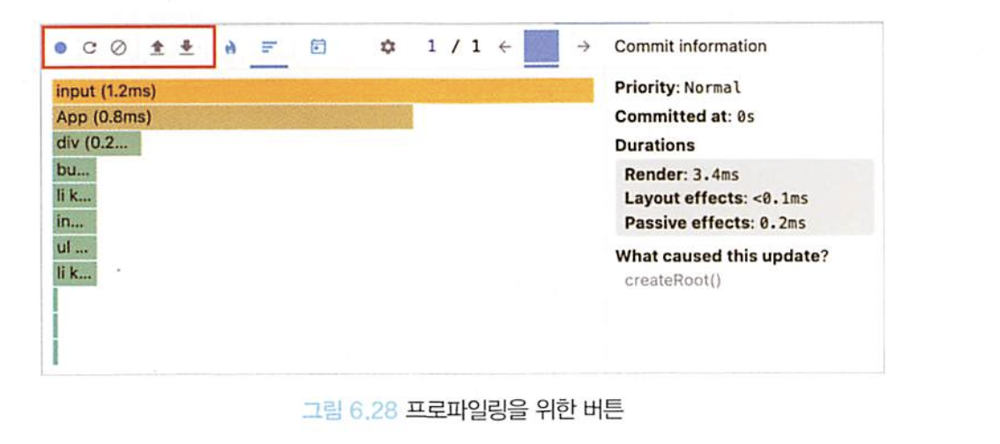

# 06. 리액트 개발 도구로 디버깅하기

## 06.3. 리액트 개발 도구 활용하기

### 06.3.1. 컴포넌트

- Components 탭에서는 현재 리액트 애플리케이션의 컴포넌트 트리를 확인할 수 있습니다.
- 단순히 컴포넌트의 구조뿐만 아니라 props와 내부 hooks등 다양한 정보를 확인할 수 있습니다.

#### 컴포넌트 트리

- Components 의 왼쪽 영역은 해당 리액트 페이지의 컴포넌트 트리를 보여줍니다. 이름 그대로 트리 구조로 구성되어있으며, 리액트 애플리케이션 전체의 트리 구조를 한눈에 보여줍니다.

  - 기명 함수로 선언되어 컴포넌트 명을 알 수있다면 해당 컴포넌트명을 보여주고, 만약 익명 함수로 서언되어 있다면 `Anonymous`라는 컴포넌트를 보여줍니다.

  ```tsx
  // App.tsx
  import AnonymousDefaultComponent from "./Component3";
  import { memo, ComponentType } from "react";

  function Component1() {
    return <>Component1</>;
  }

  const Component2 = () => {
    return <>Component2</>;
  };

  const MemoizedComponent = memo(() => <>MemoizedComponent</>);

  const withSampleHOC = (Component: ComponentType) => {
    return function () {
      return <Component />;
    };
  };

  const HOCComponent = withSampleHOC(() => <>HOCComponent</>);

  export default function App() {
    return (
      <div className="App">
        <Component1 />
        <Component2 />
        <AnonymousDefaultComponent />
        <MemoizedComponent />
        <HOCComponent />
      </div>
    );
  }

  // Component3.tsx
  export default () => {
    return <>Component3</>;
  };
  ```

  - 위 컴포넌트를 렌더링 후 리액트 개발 도구에서 확인하면 다음과 같은 결과를 확인할 수 있습니다.
    

    - 함수 선언식과 함수 표현식으로 생성한 컴포넌트는 모두 정상적으로 함수명을 표시하고 있는 것을 확인할 수 있지만, 함수 선언식 또는 표현식으로 선언되지 않은 컴포넌트는 아래와 같은 문제를 확인할 수 있습니다.
      - 익명 함수를 default로 export한 `AnonymousDefaultComponent`의 경우 `AnonymousDefaultComponent`는 코드 내부에서 사용되는 이름일 뿐, 실제로 default export로 내보낸 함수의 명칭은 추론할 수 없습니다. 따라서 `_default`로 표시됩니다.
      - memo 를 사용하여 익명 함수로 만든 컴포넌트를 감싼 경우, 함수명을 명확히 추론하지 못해서 `Anonymous`로 표시됩니다. 추가로 memo 라벨을 통해 memo로 감싸진 컴포넌트임을 알 수 있습니다.
      - 고차 컴포넌트인 `withSampleHOC`로 감싼 `HOCComponent`의 경우 두 가지 모두 `Anonymous`로 선언되어 있습니다. 이 또한 고차 컴포넌트의 명칭을 제대로 추론하지 못했기 때문입니다.
    - 리액트 16.9에서부터는 일부 명칭을 추론할 수 없는 `Anonymous`가 `_c3`, `_c5`등으로 개선되어 이러한 문제가 일부 해결되기도 했습니다.
    - 하지만 어떤 컴포넌트인지 추정할 수 있는 힌트를 얻었을 뿐 임의서 선언된 명칭으로는 개발도구에서 컴포넌트를 특정하기 어렵다는 한계는 여전히 존재합니다.

    - 이러한 문제를 해결하기 위해 컴포넌트를 기명 함수로 변경해보겠습니다.

      ```tsx
      const MemoizedComponent = memo(function MemoizedComponent() {
        return <>MemoizedComponent</>;
      });

      const withSampleHOC = (Component: ComponentType) => {
        return function withSampleHOC() {
          return <Component />;
        };
      };

      const HOCComponent = withSampleHOC(function HOCComponent() {
        return <>HOCComponent</>;
      });
      ```

      - 이런식으로 기명함수로 선언하는 경우 이전보다 훨씬 더 명확하게 컴포넌트 명칭을 확인할 수 있습니다.
      - 컴포넌트 뿐만 아니라 이후 소개할 훅 등 다양한 곳에서 동일하게 적용되므로 함수를 기명으로 두는 것은 디버깅하는 데 많은 도움이 됩니다.
      - 익명 함수로 선언하기 어려운 경우, 혹은 함수명과 별도로 특별한 명칭을 부여하여 명시적으로 확인이 필요한 경우 displayName을 적용할 수 있습니다.
        - 고차컴포넌트는 일반적으로 고차컴포넌트와 일반 컴포넌트의 조함으로 구성되므로 displayName을 잘 설정하면 디버깅에 많은 도움을 받을 수 있습니다.
        - 리액트 컴포넌트 트리가 아닌 리액트를 빌드한 트리를 확인하는 경우 기명 함수로 선언한다 하더라도 `terser` 등의 압축 도구 등이 컴포넌트명을 단순하게 난수화하기 때문에 확인이 어려워지는 경우도 존재합니다.
        - displayName또한 빌드 도구가 사용하지 않는 코드로 인식하여 삭제하는 가능성도 존재합니다.
        - 그러므로 displayName과 함수명은 개발 모드에서만 제한적으로 참고하는 것이 좋습니다.

#### 컴포넌트명과 props

##### 컴포넌트명과 Key

- 컴포넌트 명칭과 해당 함수의 key 객체를 확인할 수 있다. 빨간색 경고 이모티콘이 있는 경우는 해당 애플리케이션이 strict mode로 렌더링되지 않았다는 것을 의미합니다.

##### 컴포넌트 도구

- 컴포넌트 도구에는 3개의 아이콘이 존재합니다.
  1. 첫 번째 눈 아이콘을 클릭히면 해당 컴포넌트가 HTML의 어디에서 렌더링되었는지 확인할 수 있습니다. 누르는 즉시 크롬 개발도구의 메뉴 중 하나의 Element 탭으로 즉시 이동하며, 해당 컴포넌트가 렌더링한 HTML 요소가 선택되는 것을 볼 수 있습니다
  2. 두 번째 벌레 아이콘을 클릭하는 순간 콘솔 탭에 해당 컴포넌트의 정보가 console.log를 실행하여 기록된 것을 확인할 수 있습니다. 개발 도구 화면에서 보기에는 복잡한 정보를 확인하거나 또는 해당 정보를 복사하는 등의 용도로 확인하고 싶다면 클릭 후 콘솔 탭을 확인하면 됩니다.
     해당 내용에서는 컴포넌트가 받는 props, 컴포넌트 내부에서 사용하는 hooks, 마지막으로 해당 컴포넌트의 HTML요소인 nodes가 기록됩니다.
  3. 세 번째 소스코드 아이콘을 클릭하면 해당 컴포넌트의 소스코드를 확인할 수 있습니다. 난독화된 코드를 조금 더 가독성있게 확인하고 싶으면 `{}`아이콘을 클릭하면 됩니다.

##### 컴포넌트 props

- 해당 컴포넌트가 받은 props를 확인할 수 있습니다. 단순한 원시값뿐만 아니라 함수도 포함되어 있습니다.
- props를 클릭하면 `Go to definition`이 나타나는데, 이를 클릭하면 해당 함수가 선언된 코드로 이동하게 됩니다. 또한 값을 더블클릭하여 해당 값에 원하는 내용으로 수정할 수도 있습니다.

##### 컴포넌트 hooks

- 컴포넌트에서 사용중인 훅을 확인할 수 있습니다.
- 여기서 useState는 State와 같이 use가 생략된 이름으로 표현됩니다.
- 리액트에서 제공하는 훅이 아닌 경우 또한 useXXX에서 use가 생략된 형태로 표현됩니다.
- 대부분 useEffect에는 익명 함수로 인수를 넘겨주기 때문에 useEffect가 여러 개 선언되어 있다면 어떤 훅인지 구별하기 어렵습니다. 이 경우 기명 함수로 선언한다면 개발 도구에서 확인이 가능해집니다.

##### 컴포넌트를 렌더링한 주체, rendered by

- rendered by 에서는 해당 컴포넌트를 렌더링한 주체가 누구인지 확인할 수 있습니다.
  - production 모드에서는 `react-dom`의 버전만 확인할 수 있지만 개발 모드에서는 해당 컴포넌트를 렌더링한 부모 컴포넌트까지 확인할 수 있습니다.
  - development 모드에서는 조금 더 자세히 확인 가능합니다.

### 06.3.2. 프로파일러

- 컴포넌트 메뉴가 정적인 현재 리액트 컴포넌트 트리의 내용을 디버깅하기 위한 도구라면 프로파일러는 리액트가 렌더링하는 과정에서 발생하는 상황을 확인하기 위한 도구입니다.
- 리액트 애플리케이션이 렌더링되는 과정에서 어떤 컴포넌트가 렌더링되었는지, 또 몇차례나 렌더링이 일어났으며 어떤 작업에서 오래 걸렸는지 등 컴포넌트 렌더링 과정에서 발생하는 일을 확인할 수 있습니다.
- 프로파일러 탭은 렌더링 과정에 개압하여 디버깅에 필요한 내용을 기록해야 하기 때문에 프로덕션 빌드로 실행되는 리액트 애플리케이션에서는 사용할 수 없습니다.

#### 설정 변경하기

- 가운데 있는 톱니 모양의 설정 버튼을 클릭하면 됩니다.
- 여기에는 몇가지 중요한 설정들이 존재하는데 간단히 알아보겠습니다.
  - General 탭의 Highlight updates when components render: 컴포넌트가 렌더링될 때마다 해당 컴포넌트에 하이라이트를 표시합니다. **이 기능은 매우 유용한 기능이므로 알잘딱 잘 활용하시길 바랍니다.**
  - Debugging 탭의 Hide logs during second render in Strict Mode: 리액트 애플리케이션이 엄격 모드에서 실행되는 경우, 원활한 디버깅을 위해 useEffect등이 두 번식 동작하는 의도적인 동작이 숨겨져 있습니다.
    이로 인해 useEffect 안에 넣은 console.log가 두 번씩 출력되기도 하는데, 이를 막고 싶다면 해당 버튼을 활성화하면 됩니다.
  - Profiler 탭의 Record why each rendered while profiling: 프로파일링 도중 무엇 때문에 컴포넌트가 렌더링되었는지를 기록합니다. 애플리케이션 속도가 조금 느려질 수는 있지만 디버깅에 도움이 되는 옵션이므로 켜두는 것이 좋습니다.

#### 프로파일링

##### 프로파일링 메뉴

- 프로파일링 메뉴는 리액트가 렌더링할 때 어떠한 일이 벌어지는지를 확인할 수 있는 도구입니다.
  
  - 첫 번째 버튼은 `Start Profiling`으로, 이 버튼을 누르면 프로파일링이 시작됩니다.
  - 두 번재 버튼은 `Reload and Start profiling`(새로고침 후 프로파일링 시작)입니다. 첫 번째 버튼과 유사하지만 해당 버튼을 누르면 웹 페이지가 새로고침되면서 이와 동시에 프로파일링이 시작됩니다.
  - 세 번째 버튼은 `Stop Profiling` 버튼으로, 프로파일링된 현재 내용을 모두 지우는 버튼입니다.
  - 네 번재, 다섯 번째 버튼은 각각 `Load Profile`, `Save Profile` 버튼으로, 프로파일링 경과를 저장하고 불러오는 버튼입니다.
    - 프로파일링 결과를 저장하면 사용자의 브라우저에 해당 프로파일링 정보가 담긴 JSON 파일이 다운로드되며, 이 파일을 다시 로딩하여 프로파일링 정보를 불러올 수도 있습니다.

##### Flamegraph

- 불꽃 모양의 아이콘을 가진 `Flamegraph`탭에서는 렌더 커밋별로 어떤 작업이 일어났는지 나타냅니다.
- 컴포넌트가 트리 구조로 표현되며 각 컴포넌트에 마우스를 호버하면 해당 컴포넌트의 렌더링과 관련된 정보를 확인할 수 있습니다.
- 확인할 수 있는 정보 이외에도 해당 커밋과 관련된 추가적인 정보를 확인할 수 있습니다.
  - 해당 메뉴에서는 컴포넌트가 렌더링이 얼마나 걸렸는지 확인할 수 있을 뿐더러 렌더링되지 않은 컴포넌트에 대한 정보도 확인할 수 있습니다.
  - 렌더링되지 않은 컴포넌트는 회색으로 표시되며 `Did not render`라는 메세지가 표시되는 것을 확인할 수 있습니다.
    - 이를 활용하면 개발자가 의도한대로 메모이제이션이 동작하고 있는지, 혹은 특정 상태 변화에 따라서 렌더링이 의도한 대로 제한적으로 발생하고 있는지 확인하는 데 많은 도움을 얻을 수 있습니다.
    - **컴포넌트 트리가 복잡하고 거대하여 렌더링에 신경을 서야 하는 상황이라면 반드시 이 메뉴를 활용하여 렌더링 상황을 확인해야 합니다**
- `Flamegraph`의 오른쪽에 있는 화살표를 누르거나 세로 막대 그래프를 클릭하면 각 렌더 커밋별로 리액트 트리에서 발생한 렌더링 정보를 확인할 수 있습니다.
  - 여기에서는 렌더링이 발생한 횟수도 확인할 수 있어 개발자가 의도한 횟수만큼 렌더링이 발생했는지도 알 수 있습니다.

##### Ranked

- `Ranked` 해당 커밋에서 렌더링하는데 오랜 시간이 걸린 컴포넌트를 순서대로 나열한 그래프입니다.

#### 타임라인

- `Timeline`에서는 시간이 지남에 따라 컴포넌트에서 어떤 일이 일어났는지를 확인할 수 있습니다.
- input에 글자를 입력하면서 state의 값이 업데이트되고, 이 값이 동기로 업데이트 되었는지, 또 언제 업데이트가 이루어졌는지 등을 확인할 수 있습니다.
- `Timeline`은 시간의 흐름에 따라 리액트가 동작하고 내용을 추적하는데 유용합니다. 시간 단위로 프로파일링 기간동안 무슨 일이 있었는지, 무엇이 렌더링되었고, 도 어느 시점에 렌더링되었는지, 리액트의 유휴 시간은 어느정도였는지 등을 자세히 확인할 수 있습니다.

## 06.4. 정리

- 이번 장에서는 리액트 개발 도구에대 대한 이해를 돕기 위해 매우 간단한 구조의 코드로만 실습을 진행했습니다.
- 그러나 실제 리액트 코드를 대부분 크고 복잡한 구조를 가지고 있기 때문에 컴포넌트 구조가 복잡해지기 이전에 틈틈히 리액트 개발 도구를 활용하여 디버깅을 수행해볼 필요가 있습니다.
- 일단 개발이 완료된 애플리케이션에서 개발 도구를 열어본다면 생각보다 많은 시간이 소요되고 한눈에 내용을 파악하기도 어려워 거부감을 느낄 수도 있습니다.
  - 따라서 애플리케이션을 개발하면서 시간이 날 때마다 틈틈이 리액트 개발 도구로 컴포넌트 트리와 프로파일링을 실행하여
    의도한대로 렌더링되고 있는지,
    메모이제이션을 활용한 최적화는 잘 되고 있는지
    등을 확인할 필요가 있습니다.
- 이론적으로 이해하고 있는 사실만 믿고, 실제도 의도대로 동작하고 있는지를 확인하지 않고 개발을 이어가다 보면 자칫 실수가 나올 수 있습니다.
  - 그리고 이 실수는 실수의 크기와 관계없이 전체 애플리케이션에 대한 커다란 악영향을 미칠 수도 있습니다.
