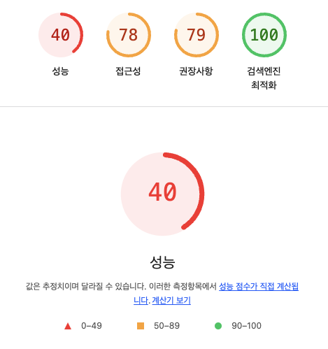

# 13. 웹페이지의 성능을 측정하는 다양한 방법

## 13.1. 애플리케이션에서 확인하기

## 13.2. 구글 라이트하우스

- 구글 라이트하우스는 구글에서 제공하는 웹페이지 성능 측정 도구로, 오픈소스로 운영되고 있습니다.
- 앞서 살펴본 핵심 웹 지표뿐만 아니라 접근성, PWA, SEO 등 웹페이지를 둘러싼 다양한 요소들을 측정하고 점검할 수 있습니다.

### 13.2.1. 구글 라이트하우스 - 탐색모드

- 일반적으로 페이지에 접속했을 때부터 페이지 로딩이 완료될 때까지의 성능을 측정하는 모드입니다.
- 이 모드로 측정을 시작하면 페이지를 처음부터 다시 불러와서 페이지 로딩이 끝날 때까지 각각의 지표를 수집합니다.
  

#### 성능

- 웹페이지의 성능과 관련된 지표를 확인할 수 있는 영역입니다.
- 핵심 웹 지표인 최초 콘텐츠풀 페인트(FCP), 최대 콘텐츠풀 페인트(LCP), 누적 레이아웃 이동(CLS) 외에도 3가지 추가적인 지표가 있습니다.
  - Time to interactive: 페이지에서 사용자가 완전히 상호작용(인터렉션)할 수 있을 때까지 걸리는 시간을 측정합니다. 여기에서 상호작용에 걸리는 시간까지란 다음과 같은 내용을 의미합니다.
    - 최초 콘텐츠풀 페인트로 측정되는 페이지가 내 콘텐츠가 표시되는 시점
    - 보여지는 페이지 요소의 대부분에 이벤트 핸들러가 부착되는 시점
    - 페이지가 유저의 상호작용에 50ms 내로 응답하는 시점
  - Speed Index: 페이지가 로드되는 동안 콘텐츠가 얼마나 빨리 시각적으로 포시되는지를 계산합니다.
  - Total Blocking Time: 메인 스레드에서 특정 시간 이상 실행되는 작업, 즉 긴 작업이 수행될 때마다 메인 스레드가 차단된 것으로 간주합니다.
    - 메인 스레드가 차단되었다고 표현하는 이유는 브라우저가 길게 실행하는 작업 때문에 무언가 다른 작업을 수행할 수 없기 때문입니다.
    - 이렇게 메인 스레드에서 실행하는 작업이 50ms 이상 걸리면 이를 긴 작업이라고 간주하고, 이렇게 실행되는 긴 작업을 모아서 Total Blocking Time(총 차단시간)이라고 합니다.

#### 접근성

- 웹 접근성을 이야기하며, 장애인 및 고령자 등 신체적으로 불편한 사람들이 일반적인 사용자와 동등하게 웹페이지를 이용할 수 있도록 보장하는 것을 이야기합니다.

#### 권장사항

- 권장사항 영역에서는 웹사이트를 개발할 때 고려해야 할 요소들을 얼마나 지키고 있는지 확인할 수 있습니다.
- 여기에서 이야기하는 권장사항에는 보안, 표준 모드, 최신 라이브러리, 소스 맵 등 다양한 요소들이 포함되어 있습니다.

#### 검색 엔진 최적화

- 검색 엔진 최적화란 웹페이지가 구글과 같은 검색엔진이 쉽게 웹페이지 정보를 가져가서 공개할 수 있도록 최적화되어있는지를 확인하는 것을 의미합니다.
- 단순히 문서를 크롤링하기 쉽게 만들었는지 확인하는 것부터, `robots.txt`가 유효한지, 이미지와 링크에 설명하는 문자가 존재하는지, `<meta>` 혹은 `<title>` 등으로 페이지의 정보를 빠르게 확인할 수 있는지 등을 확인합니다.
- 검색엔진에 최적화 되어있을수록 검색엔진의 검색결과 우선순위에 높게 나타나며, 사용자가 유입될 가능성이 높아지므로 이러한 검색엔진 최적화를 위한 다양한 요소들을 확인하고 점검할 필요가 있습니다.

### 13.2.2. 구글 라이트하우스 - 기간 모드

- 탐색 모드가 페이지가 로딩하면서 지표를 측정한 것이라면 기간 모드는 실제 웹페이지를 탐색하는 동안의 지표를 측정하는 것입니다.
- 여기에서는 앞서 볼 수 없었던 내용 두 가지를 확인할 수 있는데, 바로 흔적과 트리맵 입니다.

#### 흔적

- 흔적이라는 이름은 View Trace를 번역한 것으로, 웹 성능을 추적한 기간을 성능 탭에서 보여줍니다.
- 단순히 구글에서 제안하는 감사를 보여주는 정도를 넘어서, 상세하게 시간의 흐름에 따라 어떻게 웹페이지가 로딩되었는지를 보여줍니다.

#### 트리맵

- 트리맵은 페이지를 불러올 때 함께 로딩한 모든 리소스를 함께 모아서 볼 수 있는 곳입니다.
- 웹페이지의 전체 자바스크립트 리소스 중 어떠한 파일이 전체 데이터 로딩 중 어느 정도를 차지했는지를 비율로 확인할 수 있으며, 실제 불러온 데이터의 크기를 확인할 수도 있습니다.
- 한 가지 더 확인할 수 있는 내용은 로딩한 리소스에서 사용하지 않은 바이트의 크기를 확인하는 것 입니다.
  - 이는 실제로는 불러왔지만 사용되지 않은 리소스를 의미입니다.
  - 이 또한 전체 리소스에서 어느 정도 비율인지 확인할 수 있지만 틱정 시나리오에서만 실행되는 리소스도 있기 때문에 꼭 사용하지 않았다록 해서 불필요한 것이라고 단정 지을 수 없습니다.
  - 다만 사용하지 않은 바이트의 크기가 불필요하기 크다면 번들링된 리소스에서 블필요한 것이 없는지 확인해 보는 것이 좋습니다.

### 13.2.3. 구글 라이트하우스 - 스냅샷

- 스냅샷 모드는 탐색 모드와 매우 유사하지만 현재 페이지 상태를 기준으로 분석한다는 차이점이 존재합니다.
- 즉, 현재 상태에서 검색 엔진 최적화, 접근성, 성능 등을 분석할 수 있습니다.
- 페이지 로딩이 아닌 특정 페이지 특정 상태를 기준으로 분석하고 싶으면 스냅샷 모드를 사용하면 됩니다.

## 13.3. WebPageTest

- WebPageTest는 웹사이트 성능을 분석하는 도구로 가장 널리 알려진 도구입니다.
- 구글에서 제공하는 라이트하우스, 크롬 개발자 도구 등은 무료로 제공되면서도 개발자들이 쉽게 사용할 수 있는 분석 도구이지만, WebPageTest는 무료 기능도 있지만 유료로 제공하는 분석 도구도 있을 만큼 웹사이트 성능을 분석할 수 있는 심도 있는 기능이 많습니다.
- 그러나 유료로 결제하지 않더라도 무료로 제공되는 기능만으로도 웹사이트의 성능과 로딩 과정에서 일어나는 일을 분석하는데에는 충분합니다.
- WebPageTest에서 제공하는 분석 도구는 크게 다섯 가지로 분류됩니다.
  - Site Performance: 웹사이트의 성능 분석을 위한 도구
  - Core Web Vitals: 웹사이트의 핵심 웹 지표를 확인하기 위한 도구
  - Lighthouse: 구글 라이트하우스 도구
  - Visual Comparison: 2개 이상의 사이트를 동시에 실행하여 시간의 흐름에 따른 로딩 과정을 비교하는 도구
  - Traceroute: 네트워크 경로를 확인하는 도구

> 나머지 내용은 그냥 읽고 마무리 했습니다.
